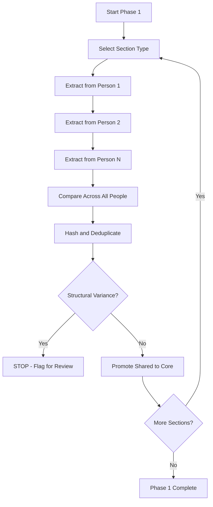
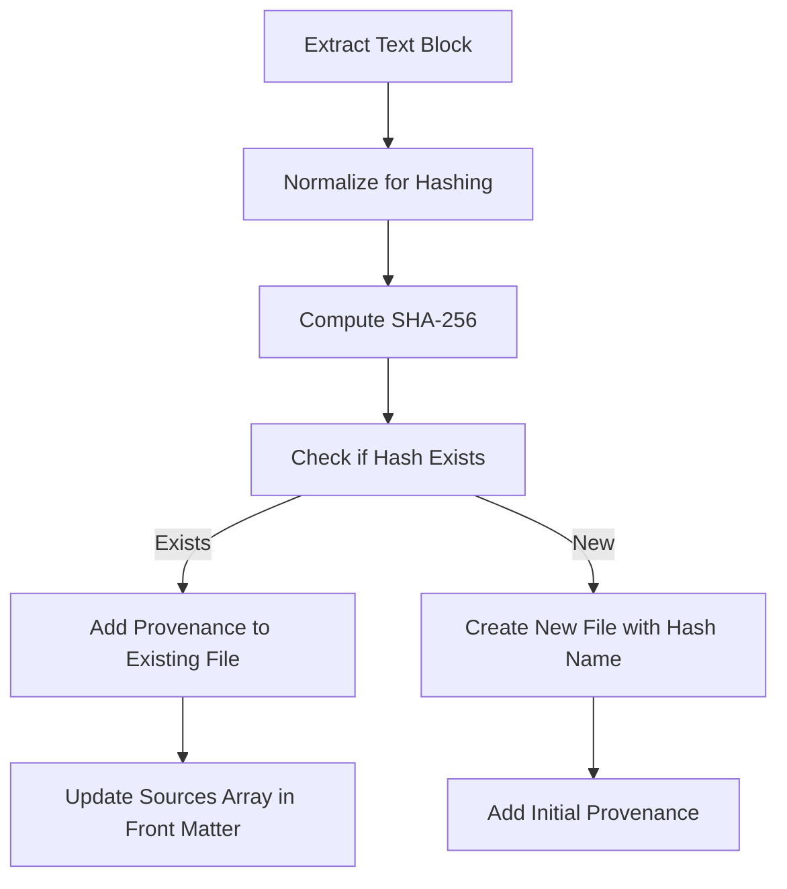

# AI/RAG Project Module

**Module Type:** Domain-Specific Extension  
**Extends:** Multi-Agent Governance Standard v1.0 Core  
**Date:** January 3, 2026  
**Status:** Stable (Extracted from production RAG system)

---

## Purpose

This module extends the Core Standard with patterns specific to AI/RAG (Retrieval-Augmented Generation) projects, particularly those involving:

- Knowledge pack creation from source documents
- Text extraction and chunking
- Cross-document deduplication
- Provenance tracking
- Content normalization for embedding

**Prerequisites:** Read Core Standard first. This module assumes familiarity with three-layer rules architecture, agent boundaries, and handoff protocols.

---

## Table of Contents

1. [Why RAG Projects Are Different](#why-rag-projects-are-different)
2. [RAG-Specific Challenges](#rag-specific-challenges)
3. [Horizontal-First Processing Pattern](#horizontal-first-processing-pattern)
4. [Verbatim Extraction Standards](#verbatim-extraction-standards)
5. [Hash-Based Deduplication](#hash-based-deduplication)
6. [Provenance Tracking (The Golden Thread)](#provenance-tracking-the-golden-thread)
7. [Core/Overlay Architecture](#coreoverlay-architecture)
8. [Fail-Fast on Ambiguity](#fail-fast-on-ambiguity)
9. [Content Type Catalogs](#content-type-catalogs)
10. [Semantic Atomicity](#semantic-atomicity)
11. [File Naming Conventions for RAG](#file-naming-conventions-for-rag)
12. [Rules File Template](#rules-file-template)

---

## Why RAG Projects Are Different

### Traditional Software vs RAG Knowledge Packs

| Traditional Software | RAG Knowledge Pack |
|---------------------|-------------------|
| Code creates behavior | Text creates context |
| Compilation validates | Embedding quality validates |
| DRY principle (no duplication) | Strategic duplication (same content, different contexts) |
| Exact matching | Semantic similarity |
| Tests verify behavior | Provenance verifies source fidelity |
| Refactoring preserves behavior | Paraphrasing destroys retrieval |

### The Core Difference

**Software development:** You build systems that DO things.

**RAG development:** You build knowledge that INFORMS things.

This fundamental difference requires different standards:

- **Verbatim extraction** (not code generation)
- **Provenance tracking** (not test coverage)
- **Deduplication strategies** (not DRY refactoring)
- **Semantic chunking** (not functional decomposition)

---

## RAG-Specific Challenges

### 1. The Paraphrasing Trap

**Problem:** AI agents naturally want to "clean up" or "improve" extracted text.

**Why It's Fatal:** RAG retrieval depends on text similarity to source material. Paraphrasing:
- Changes embedding vectors
- Breaks semantic search
- Loses domain-specific terminology
- Destroys future source reconciliation

**Solution:** Verbatim-only extraction with explicit no-paraphrase rule.

### 2. The Over-Chunking Problem

**Problem:** Text chunking by character count splits mid-concept.

**Example (Bad):**
```
Chunk 1: "The Achiever theme is characterized by a constant need for..."
Chunk 2: "...achievement. People with this theme feel they must accomplish"
```

Vector embeddings for these chunks will be weak because neither captures the complete concept.

**Solution:** Semantic atomicity — chunk by conceptual boundaries.

### 3. The Duplication Detection Problem

**Problem:** Same content appears in multiple source documents. How do you know it's truly the same?

**Traditional Approach (Fails):**
- String equality (breaks with formatting differences)
- Manual review (doesn't scale)

**Solution:** Hash-based matching with normalization.

### 4. The Provenance Loss Problem

**Problem:** After extraction and transformation, you can't trace content back to source.

**Why It Matters:**
- Can't validate accuracy
- Can't update when source changes
- Can't explain retrieval results
- Can't audit for hallucination

**Solution:** The Golden Thread (provenance in every file).

### 5. The Context Collapse Problem

**Problem:** Extracted content loses surrounding context that makes it meaningful.

**Example:**
Extracting "This strength helps you succeed" without capturing WHICH strength or WHO the "you" refers to.

**Solution:** Self-contained semantic units with embedded context.

---

## Horizontal-First Processing Pattern

### The Anti-Pattern: Vertical Processing

**Vertical (Don't Do This):**

```
1. Process Person A completely (all reports, all themes)
2. Process Person B completely  
3. Process Person C completely
4. Try to deduplicate after the fact
```

**Why It Fails:**
- Deduplication happens too late
- Hard to compare across people
- Can't identify shared patterns until all processing done
- Structural variances discovered late

### The Pattern: Horizontal Processing

**Horizontal (Do This):**

```
1. Extract SAME section from ALL people
2. Compare immediately for patterns
3. Identify shared vs unique content
4. Move to next section only after completing across all people
```

**Why It Works:**
- Deduplication happens during extraction
- Structural variances caught early
- Shared patterns obvious immediately
- Can stop if structure doesn't match expectations

### Implementation



### Example: Processing Theme Definitions

**Step 1:** Extract "What Is Intellection?" from ALL people
```
Brandon:  "People exceptionally talented in the Intellection theme..."
Muhammad: "People exceptionally talented in the Intellection theme..."
Atif:     "People exceptionally talented in the Intellection theme..."
```

**Step 2:** Compare immediately — They're identical!

**Step 3:** Promote to `core/themes/definitions/intellection.md` with provenance from all three

**Step 4:** Move to next theme (Achiever, Relator, etc.)

**Validate-First Approach:**

Before processing all 34 themes:
1. Do 2-3 themes end-to-end
2. Verify fidelity (no data loss)
3. Check deduplication works
4. Confirm structure matches
5. THEN scale to remaining themes

---

## Verbatim Extraction Standards

### The No-Paraphrase Rule

**Rule:** Extract text exactly as it appears in the source. No summarizing, no rewording, no "cleaning up."

**Implementation in `.rules/10-rag-standards.md`:**

```markdown
## Verbatim Extraction

Extract text exactly as it appears. No paraphrasing, no summarizing, no rewriting.

**Allowed:**
- Normalize bullets (• → -)
- Normalize whitespace (multiple spaces → single space)
- Normalize line breaks (preserve meaningful breaks, collapse excess)

**Not Allowed:**
- Changing words or phrasing
- Summarizing paragraphs
- "Improving" grammar
- Modernizing terminology
- Correcting perceived errors in source
```

### Structure Preservation

**Keep:**
- Headings (with original hierarchy)
- Bullet points (normalized to markdown)
- Paragraph breaks (meaningful boundaries)
- Bold/italic emphasis (where semantically meaningful)

**Remove:**
- Page numbers
- Headers/footers
- Copyright notices (to `_discarded/` for audit)
- Navigation elements (in HTML)

### When Normalization Is Allowed

**Text normalization** for hashing purposes:
```python
def normalize_for_hashing(text):
    """Normalize text for hash comparison (not for storage)."""
    text = text.lower()
    text = re.sub(r'\s+', ' ', text)  # Collapse whitespace
    text = re.sub(r'[^\w\s]', '', text)  # Remove punctuation
    text = text.strip()
    return text
```

**Store original, hash normalized.**

### Handling Extraction Errors in Source

**If source has typos/errors:**

Extract verbatim. Do NOT correct.

**Rationale:** 
- Your job is preservation, not editing
- Source might be intentional
- Corrections lose traceability
- Updates should come from source, not extraction

**If genuinely unclear:**

Flag with `needs_review: true` in front matter. Let human decide.

---

## Hash-Based Deduplication

### Why Hashing?

**Problem:** How do you know if two text blocks are "the same" when:
- Formatting differs (spaces, line breaks)
- Source files differ
- Extraction timestamps differ

**Solution:** Hash normalized content. Same hash = same content.

### Hash Strategy

**Algorithm:** SHA-256

**Why SHA-256:**
- Collision-resistant (won't get false matches)
- Deterministic (same input = same hash)
- Fast to compute
- Standard across platforms

**File Naming:** Use first 8 characters of hash

Example: `a1b2c3d4.md` (full hash stored in front matter)

### Normalization for Hashing

Before hashing, normalize:

```python
import hashlib
import re

def compute_content_hash(text):
    """Compute hash for deduplication."""
    # Normalize
    normalized = text.lower()
    normalized = re.sub(r'\s+', ' ', normalized)
    normalized = re.sub(r'[^\w\s]', '', normalized)
    normalized = normalized.strip()
    
    # Hash
    hash_obj = hashlib.sha256(normalized.encode('utf-8'))
    full_hash = hash_obj.hexdigest()
    
    return {
        'full': full_hash,
        'short': full_hash[:8]
    }
```

### Handling Hash Collisions

**True Collision (Extremely Rare):**

If two DIFFERENT texts produce the same 8-char prefix:

1. Use 12 characters instead: `a1b2c3d4e5f6.md`
2. If still collision: Use full 64-char hash
3. Log to `_work/hash-collisions.json`

**Near-Match (>90% Similar):**

If normalized texts are 90-95% similar but not identical:

1. Flag for manual review
2. Store both with different hashes
3. Log to `_work/near-matches.json`
4. Human decides: truly different or formatting variance

### Deduplication Workflow



### Example: "Why Your Theme Is Unique" Deduplication

**Scenario:** 5 people, each has "Why Your Intellection Is Unique" section with 5 paragraphs.

**Process:**

1. Extract paragraph 1 from Person A → hash: `a1b2c3d4`
2. Extract paragraph 1 from Person B → hash: `a1b2c3d4` (same!)
3. Extract paragraph 1 from Person C → hash: `e5f6g7h8` (different!)
4. Continue for all people, all paragraphs

**Result:**

```
core/themes/intellection/why-unique/
├── a1b2c3d4.md  (used by Person A, B)
├── e5f6g7h8.md  (used by Person C)
├── i9j0k1l2.md  (used by Person D, E)
└── m3n4o5p6.md  (used by Person A - their paragraph 2)
```

**Front Matter in `a1b2c3d4.md`:**

```yaml
---
hash: "a1b2c3d4567890abcdef..." # Full hash
theme: "intellection"
sources:
  - person: "brandon-mcpeak"
    report: "SF_TOP_5"
    position: 1
  - person: "muhammad-waqas"
    report: "SF_TOP_5"  
    position: 1
---

[Verbatim paragraph text here]
```

---

## Provenance Tracking (The Golden Thread)

### Why Provenance Matters

**Use Cases:**
1. **Validation** — Trace generated content back to source
2. **Updates** — When source changes, know what to regenerate
3. **Auditing** — Explain why content was included
4. **Debugging** — Find extraction errors
5. **Legal** — Demonstrate proper attribution

### The Golden Thread Principle

**Every generated artifact MUST preserve metadata linking it to source.**

No orphan content. Everything traceable.

### Required Provenance Fields

**Minimum (Required):**

```yaml
---
source:
  file: "McPeak-Brandon-SF_TOP_5.pdf"
  page: 3
---
```

**Enhanced (Recommended):**

```yaml
---
id: "cs:core:intellection:theme_description:a1b2c3d4"
namespace: "core"  # or "person" or "portal"
content_type: "theme_description"
theme: "Intellection"
domain: "Strategic Thinking"
source:
  - person: "Brandon McPeak"
    file: "McPeak-Brandon-SF_TOP_5.pdf"
    page: 3
    report_type: "SF_TOP_5"
    extraction_date: "2025-12-22"
    location_hint: "Why Your Intellection Is Unique - Paragraph 1"
hash:
  normalized: "a1b2c3d4567890..."
  algorithm: "sha256"
corroboration:
  status: "confirmed"  # or "needs_corroboration"
  matches: 2
tags:
  - cliftonstrengths
  - intellection
  - strategic-thinking
---
```

### Multi-Source Provenance

When content appears in multiple sources:

```yaml
---
sources:
  - person: "Brandon McPeak"
    file: "McPeak-Brandon-SF_TOP_5.pdf"
    page: 3
    report_type: "SF_TOP_5"
  - person: "Muhammad Waqas"
    file: "Waqas-Muhammad-SF_TOP_5.pdf"
    page: 3
    report_type: "SF_TOP_5"
  - person: "Atif Shaikh"
    file: "Shaikh-Atif-ALL_34.pdf"
    page: 12
    report_type: "ALL_34"
---
```

### Provenance in Overlays

Person-specific overlays reference core with provenance:

```json
{
  "person": "brandon-mcpeak",
  "theme": "intellection",
  "rank": 1,
  "why_unique_paragraphs": [
    {
      "position": 1,
      "ref": "core/themes/intellection/why-unique/a1b2c3d4.md",
      "hash": "a1b2c3d4"
    },
    {
      "position": 2,
      "ref": "core/themes/intellection/why-unique/m3n4o5p6.md",
      "hash": "m3n4o5p6"
    }
  ]
}
```

---

## Core/Overlay Architecture

### The Pattern

**Problem:** Some content is universal (shared by everyone). Some content is person-specific. How do you avoid duplication while preserving individual context?

**Solution:** Two-layer architecture.

```
┌─────────────────────────────────────────┐
│  PERSON OVERLAY (thin, mostly pointers) │
│  - Theme rankings                       │
│  - Pointers to core blocks              │
│  - Truly unique content only            │
│  - Report reconstruction blueprints     │
└─────────────┬───────────────────────────┘
              │ references
              ▼
┌─────────────────────────────────────────┐
│  CORE KNOWLEDGE (universal, deduplicated)│
│  - Theme definitions                    │
│  - Common "why unique" paragraphs       │
│  - Domain descriptions                  │
│  - Shared concepts                      │
└─────────────────────────────────────────┘
```

### Core Promotion Rules

**When to promote to core:**

1. **Identical across ≥2 people** → Promote with `confirmed` status
2. **Single observation** → Promote with `needs_corroboration: true`
3. **Obviously universal by structure** → Promote

**When to keep in person overlay:**

1. **Non-identical** after normalization
2. **Proven person-specific** (like rankings)

### Core Promotion Strategy: Aggressive, Safe

**Philosophy:** Default to core. Easier to move person-specific content OUT of core than to merge INTO core later.

**Process:**

```
Phase 1: Extract horizontally, ALL content goes to core
Phase 2: Hash matching identifies duplicates
Phase 3: Single-observation blocks tagged needs_corroboration
Phase 4: Person overlays created as pointer+routing files
```

### Example: Theme Definition (Always Core)

```
core/themes/definitions/intellection.md
```

```yaml
---
id: "cs:core:intellection:definition"
content_type: "theme_definition"
theme: "Intellection"
domain: "Strategic Thinking"
sources:
  - file: "McPeak-Brandon-SF_TOP_5.pdf"
    page: 3
  - file: "Waqas-Muhammad-ALL_34.pdf"
    page: 15
corroboration:
  status: "confirmed"
  matches: 5
---

# Intellection

People exceptionally talented in the Intellection theme are characterized 
by their intellectual activity. They are introspective and appreciate 
intellectual discussions.
```

### Example: Person Overlay (Thin)

```
people/brandon-mcpeak/_profile.json
```

```json
{
  "person": "Brandon McPeak",
  "slug": "brandon-mcpeak",
  "themes": {
    "top_5": ["Intellection", "Relator", "Ideation", "Input", "Learner"],
    "all_34_ranks": {
      "Intellection": 1,
      "Relator": 2,
      "Ideation": 3,
      "Input": 4,
      "Learner": 5,
      "Strategic": 6
      // ... all 34
    }
  },
  "reports": {
    "SF_TOP_5": "McPeak-Brandon-SF_TOP_5.pdf",
    "ALL_34": "McPeak-Brandon-ALL_34.pdf",
    "ROLE_LEADERS": "McPeak-Brandon-ROLE_LEADERS.pdf",
    "ROLE_MANAGER": "McPeak-Brandon-ROLE_MANAGER.pdf"
  }
}
```

### Overlay Routing Pattern

Person overlays don't duplicate content—they route to it:

```
people/brandon-mcpeak/overlays/top-5.json
```

```json
{
  "report_type": "SF_TOP_5",
  "sections": [
    {
      "type": "intro",
      "ref": "core/reports/sf-top-5/intro.md"
    },
    {
      "type": "theme",
      "theme": "Intellection",
      "rank": 1,
      "definition": "core/themes/definitions/intellection.md",
      "why_unique": [
        "core/themes/intellection/why-unique/a1b2c3d4.md",
        "core/themes/intellection/why-unique/m3n4o5p6.md"
      ],
      "apply": "core/exercises/intellection/apply-top5.md"
    }
    // ... more themes
  ]
}
```

---

## Fail-Fast on Ambiguity

### The RAG-Specific Stop Conditions

**STOP and report immediately if:**

1. **Classification failure** — Cannot determine document type
2. **Theme boundaries unclear** — Can't identify where one theme ends
3. **Rank disagreement** — Person's reports have conflicting rankings
4. **Extraction gaps >20%** — Large sections unextracted
5. **Unexpected structure** — Format doesn't match expected pattern
6. **Hash collision with different content** — Extremely rare but critical

### Example Stop Condition: Classification

**Scenario:** PDF filename doesn't match any known pattern.

```python
# scripts/phase-0-classify.py

for pdf in pdf_files:
    report_type = classify_pdf(pdf)
    if report_type is None:
        # STOP - Don't guess
        log_unclassified(pdf)
        print(f"🚨 STOP: Cannot classify {pdf}")
        print(f"Add to _work/unclassified.json for review")
        sys.exit(1)
```

**Don't proceed** with unknown PDFs. User must:
- Add to exclusion list (not CliftonStrengths), OR
- Update classification patterns, OR
- Manually classify

### Example Stop Condition: Theme Count Mismatch

**Expected:** SF_TOP_5 report should have exactly 5 themes

```python
themes_found = extract_themes(report)
if len(themes_found) != 5:
    print(f"🚨 STOP: Expected 5 themes, found {len(themes_found)}")
    print(f"Report: {report.filename}")
    print(f"Themes found: {themes_found}")
    sys.exit(1)
```

### The "STOP and Ask" Protocol

**When agent encounters ambiguity:**

```markdown
## 🚨 STOP: Ambiguity Detected

**Issue:** Theme boundary unclear in Section X

**Context:**
- Report: McPeak-Brandon-ALL_34.pdf
- Page: 15
- Expected: Clear heading "Theme: Achiever"
- Found: Heading "Your Achiever Talents"

**Question:**
Should I treat "Your [Theme] Talents" as equivalent to "Theme: [Theme]"?

**Options:**
1. Treat as equivalent and proceed
2. Update pattern matching rules
3. Manual review required

**Current state:** Stopped at Achiever (Theme 3 of 34)
```

---

## Content Type Catalogs

### Why Catalogs Matter

RAG projects have **many content types** with different:
- Chunking strategies
- Storage locations
- Deduplication rules
- Front matter schemas

**Without a catalog:** Each agent reinvents classification on every session.

**With a catalog:** Explicit registry in `.rules/20-content-types.md`

### Catalog Structure

```markdown
# Content Types Catalog

## Theme-Level Content

| Content Type | Location | Chunking | Deduplication | Notes |
|--------------|----------|----------|---------------|-------|
| Theme definitions | `core/themes/definitions/<theme>.md` | Whole section | Always | Universal |
| "Why Unique" paragraphs | `core/themes/<theme>/why-unique/<hash>.md` | Individual paragraph | Hash-based | Gallup varies |
| Blends | `core/blends/<a>__<b>.md` | Whole description | Compare across people | Directional |

## Role-Specific Content

| Content Type | Location | Chunking | Deduplication | Notes |
|--------------|----------|----------|---------------|-------|
| How Contributes | `core/themes/<theme>/contributes-<role>.md` | Whole section | Compare across people | MANAGER/LEADER |
| Blind Spots | `core/themes/<theme>/blind-spots-<role>.md` | Whole section | Compare across people | MANAGER/LEADER |
| Action Items | `core/themes/<theme>/action-items-<role>.md` | Whole section | Compare across people | MANAGER/LEADER |

## Fallback Directories

| Directory | Purpose |
|-----------|---------|
| `core/_undefined/` | Content types not in this catalog |
| `core/_undecided/` | Unclear chunking strategy |
| `core/_discarded/` | Legal/copyright for audit |
```

### Using the Catalog

**When extracting content:**

1. Read catalog first
2. Match content to type
3. Follow chunking strategy
4. Store in specified location
5. **If no match:** Put in `_undefined/` and flag

**Catalog is Law:** Don't invent new locations. Either:
- Use catalog location, OR
- Propose catalog update

### Updating the Catalog

**When new content type discovered:**

1. Extract to `_undefined/` directory
2. Flag in report with ❓
3. Propose catalog entry:
   ```markdown
   ## Suggested Catalog Addition
   
   **Content Type:** "Apply Your Theme to Succeed" checklists
   **Proposed Location:** `core/exercises/<theme>/apply-top5.md`
   **Chunking:** Whole checklist (self-contained)
   **Deduplication:** Compare across people (expect universal)
   **Rationale:** Distinct from action items; focused on practical application
   ```
4. Wait for approval
5. Update catalog
6. Move from `_undefined/` to proper location

---

## Semantic Atomicity

### The Principle

**Rule:** Never split a text chunk in the middle of a conceptual unit.

**Why:** Vector embeddings work best on complete thoughts. Splitting mid-concept produces weak embeddings.

### Bad Chunking (By Character Count)

```
// Chunk 1 (500 chars)
"The Intellection theme is characterized by your intellectual 
activity. You are introspective and appreciate intellectual 
discussions. You like thinking and mental activity. You might 
not be interested in just exercising your brain with trivial 
games and puzzles. You want your mind to be engaged with ideas 
and concepts that challenge you. You are the kind of person who 
enjoys being alone because it gives you time to reflect and thin"

// Chunk 2 (500 chars)
"k. When you are alone, you have the opportunity to think about 
what is going on around you..."
```

**Problem:** "reflect and thin" / "k" split is meaningless.

### Good Chunking (By Semantic Unit)

```
// Chunk: Complete concept
"The Intellection theme is characterized by your intellectual 
activity. You are introspective and appreciate intellectual 
discussions. You like thinking and mental activity. You might 
not be interested in just exercising your brain with trivial 
games and puzzles. You want your mind to be engaged with ideas 
and concepts that challenge you."

// Chunk: Next complete concept  
"You are the kind of person who enjoys being alone because it 
gives you time to reflect and think. When you are alone, you 
have the opportunity to think about what is going on around you."
```

### Semantic Boundary Detection

**For CliftonStrengths content, boundaries are:**

**Paragraph starters:**
- "Driven by your talents..."
- "It's very likely that..."
- "Because of your strengths..."
- "Chances are good that..."
- "Instinctively..."
- "By nature..."

**Section headings:**
- "What Is [Theme]?"
- "Why Your [Theme] Is Unique"
- "[Theme] + [OtherTheme]"
- "How This Theme Contributes..."

**For general text, boundaries are:**
- Paragraph breaks (blank lines)
- Section headings (##, ###)
- List boundaries (complete bullet list)

### Chunking Strategy Per Content Type

From content type catalog:

| Content Type | Chunking Strategy | Why |
|--------------|-------------------|-----|
| Theme definitions | Whole section | Self-contained, single concept |
| "Why Unique" paragraphs | Individual paragraph | Each paragraph is complete thought |
| Blends | Whole description | Pairing explanation is atomic |
| Role sections | Whole section (heading + bullets) | Bullets depend on heading context |
| Apply checklists | Whole checklist | Items are related action set |

**Never chunk:**
- Mid-sentence
- Mid-list-item
- Mid-paragraph (unless paragraph >1000 words, then review)

---

## File Naming Conventions for RAG

### Themes

**Format:** Lowercase, kebab-case

```
intellection.md
self-assurance.md
strategic-thinking.md  # Note: compound names hyphenated
```

### Hash-Named Files

**Format:** 8-character hex (from SHA-256)

```
a1b2c3d4.md
e5f6g7h8.md
```

**If collision:** Extend to 12 or 16 characters

### Blend Files

**Format:** Directional with double underscore

```
intellection__relator.md    # Intellection + Relator (in that order)
relator__intellection.md    # Relator + Intellection (different!)
```

**Why directional:** "Achiever through lens of Strategic" ≠ "Strategic through lens of Achiever"

### Person Directories

**Format:** Kebab-case

```
brandon-mcpeak/
muhammad-waqas/
shaikh-atif/
```

**Slug generation:**
```python
def person_to_slug(name):
    """Convert person name to directory slug."""
    slug = name.lower().replace(" ", "-")
    # Remove apostrophes
    slug = slug.replace("'", "")
    # Transliterate if needed
    return slug
```

---

## Rules File Template

### `.rules/10-rag-standards.md`

```markdown
# RAG Data Integrity Standards

## Semantic Atomicity

Never split a text chunk in the middle of a conceptual unit. Use 
layout-aware splitting, not character counts.

**Why:** Splitting mid-concept destroys vector embedding quality.

## The Golden Thread (Provenance)

Every generated markdown artifact MUST preserve metadata link to source.

**Required format:**
\`\`\`yaml
source:
  file: <source_filename>
  page: <page_number or range>
  section: <section_header if applicable>
\`\`\`

**Why:** Debug retrieval, trace accuracy, update when source changes.

## Immutable Entity IDs

Entity IDs are deterministic. Use hashing (first 8 chars SHA-256) not UUIDs.

**Why:** Prevents duplicates on re-processing. Same content = same ID.

## Verbatim Extraction

Extract text exactly as appears. No paraphrasing, no summarizing, no "improving."

**Why:** RAG retrieval depends on matching source material.

## Horizontal-First Processing

Extract same section from ALL sources before moving to next section.

**Why:** Enables immediate deduplication, catches structural variances early.

## Fail-Fast on Classification

If document type cannot be determined with certainty: STOP. Log to 
`_work/unclassified.json`. Never guess.

**Why:** Wrong classification cascades errors through entire pipeline.

## Core Promotion Rules

- Identical across ≥2 sources → `core/` with `confirmed` status
- Single observation → `core/` with `needs_corroboration: true`  
- Non-identical → `people/<person>/unique/`

**Why:** Aggressive promotion to core, with safety flag for unconfirmed.
```

### `.rules/20-content-types.md`

```markdown
# Content Types Catalog

[Full catalog table as shown in Content Type Catalogs section]

## Adding New Content Types

If you discover content not in this catalog:

1. Put it in `core/_undefined/`
2. Flag in extraction report with ❓ emoji
3. Propose a location and chunking strategy
4. Wait for approval before adding to catalog
5. Never invent new locations without updating catalog

## Fallback Directories

| Directory | Purpose | When to Use |
|-----------|---------|-------------|
| `_undefined/` | Unknown content types | Content doesn't match catalog |
| `_undecided/` | Unclear chunking | Structure varies unexpectedly |
| `_discarded/` | Legal/copyright | Non-content for audit |
```

---

## Implementation Checklist

Use this checklist when setting up a RAG project with multi-agent governance:

### Core Setup (From Core Standard)
- [ ] Complete Core Standard implementation checklist
- [ ] Verify three-layer rules architecture
- [ ] Verify planning directory structure
- [ ] Verify agent boundaries defined

### RAG-Specific Rules
- [ ] Create `.rules/10-rag-standards.md`
- [ ] Create `.rules/20-content-types.md`
- [ ] Create pointer files in `.cursor/rules/` and `.kilocode/rules/`
- [ ] Update `.rules/README.md` with RAG rules

### Directory Structure
- [ ] Create `_inputs/` directory for source documents
- [ ] Create `_work/` directory for intermediate files
- [ ] Create `core/` directory with subdirectories:
  - [ ] `core/_undefined/`
  - [ ] `core/_undecided/`
  - [ ] `core/_discarded/`
- [ ] Create domain-specific subdirectories in `core/`
- [ ] Create `people/` directory for overlays

### Extraction Scripts
- [ ] Create `scripts/phase-0-classify.py` (or equivalent)
- [ ] Implement stop condition on unclassified documents
- [ ] Create hash computation utility
- [ ] Create normalization functions
- [ ] Test on 2-3 sample documents before scaling

### Validation
- [ ] Test horizontal extraction on one section type
- [ ] Verify hash-based deduplication works
- [ ] Verify provenance tracked in front matter
- [ ] Test semantic chunking boundaries
- [ ] Validate-first before scaling to full dataset

---

## Common Anti-Patterns to Avoid

### 1. Vertical-First Processing

**Don't:**
```
Extract Person A → All themes → All reports
Extract Person B → All themes → All reports
Try to deduplicate
```

**Do:**
```
Extract Theme 1 → From all people → Deduplicate
Extract Theme 2 → From all people → Deduplicate
```

### 2. Paraphrasing Extraction

**Don't:**
```
"The Achiever theme means you always want to accomplish things"
(paraphrased from source)
```

**Do:**
```
"People exceptionally talented in the Achiever theme work hard 
and possess a great deal of stamina."
(verbatim from source)
```

### 3. Character-Count Chunking

**Don't:**
```python
chunks = [text[i:i+500] for i in range(0, len(text), 500)]
```

**Do:**
```python
chunks = split_by_semantic_boundaries(text, boundaries=paragraphs)
```

### 4. Missing Provenance

**Don't:**
```yaml
---
title: "Intellection Theme"
---
```

**Do:**
```yaml
---
title: "Intellection Theme"
source:
  file: "McPeak-Brandon-SF_TOP_5.pdf"
  page: 3
  extraction_date: "2025-12-22"
---
```

### 5. Guessing on Ambiguity

**Don't:**
```python
if theme_boundary_unclear:
    # Guess based on page number
    theme = infer_theme_from_page(page_num)
```

**Do:**
```python
if theme_boundary_unclear:
    log_ambiguity(page_num, context)
    raise ExtractionError("Theme boundary unclear - manual review required")
```

---

## Success Metrics

Track these metrics to validate RAG extraction quality:

### Extraction Fidelity
- **Target:** >98% of source content extracted
- **Measure:** Manual audit of sample pages
- **Fail condition:** >20% gaps

### Deduplication Rate
- **Target:** 60-80% deduplication across people (varies by content type)
- **Measure:** Hash matches / total blocks
- **Insight:** Low rate might indicate structural variance

### Provenance Coverage
- **Target:** 100% of files have source metadata
- **Measure:** Grep for files missing `source:` in front matter
- **Fail condition:** Any files without provenance

### Semantic Atomicity
- **Target:** 0 mid-concept splits
- **Measure:** Manual review of chunk boundaries
- **Sample:** 10% of chunks per content type

### Classification Accuracy
- **Target:** 100% classified or explicitly unclassified
- **Measure:** `len(unclassified_list) == 0`
- **Fail condition:** Any unclassified documents

---

## Conclusion

RAG projects require different patterns than traditional software:

- **Verbatim over paraphrase**
- **Provenance over test coverage**
- **Semantic chunking over character counts**
- **Horizontal processing over vertical**
- **Fail-fast on ambiguity**

Combined with Core Standard governance, these patterns create:
- Traceable knowledge bases
- Reproducible extraction
- Scalable deduplication
- Maintainable RAG systems

**Next Steps:**
1. Implement Core Standard
2. Add RAG-specific rules
3. Start with validate-first (2-3 documents)
4. Scale horizontally across full dataset

