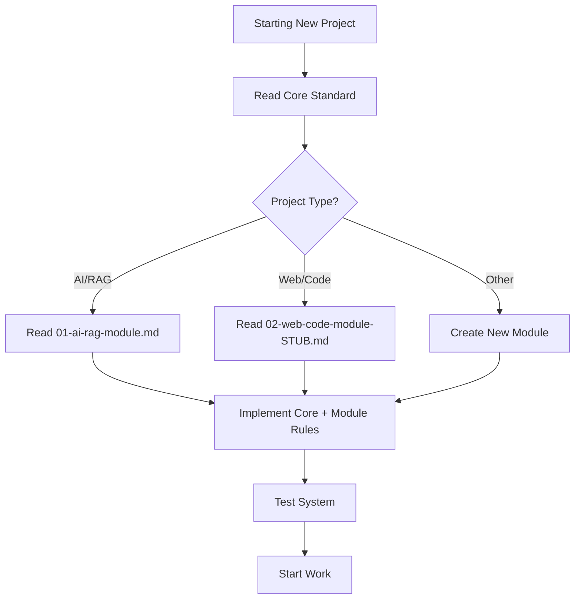

# Modules README

**Location:** `_work/external-outputs/modules/README.md`

---

## Purpose

This directory contains domain-specific extensions to the Multi-Agent Governance Standard. Each module extends the Core Standard with patterns specific to particular project types.

---

## Module Structure

```
modules/
├── README.md (this file)
├── 01-ai-rag-module.md          # For AI/RAG projects
└── 02-web-code-module-STUB.md   # For web/application projects
```

---

## How to Use Modules

### For New Projects

**Step 1: Implement Core Standard First**

Before using any module, implement the Core Standard from `../multi-agent-governance-standard-v1.md`:

- ✅ Three-layer rules architecture
- ✅ Planning directory structure  
- ✅ Agent role definitions
- ✅ Handoff protocol
- ✅ Required protocols (conflict checking, system coherence, reporting)

**Step 2: Choose Your Module(s)**

Select the module(s) that match your project type:

| Project Type | Module | Status |
|--------------|--------|--------|
| AI/RAG, Knowledge Packs, Data Extraction | `01-ai-rag-module.md` | ✅ Complete |
| Web Apps, APIs, Traditional Code | `02-web-code-module-STUB.md` | ⚠️ Stub (universal rules complete, framework stubs to expand) |

**Step 3: Implement Module Rules**

Follow the module-specific implementation checklist:

- Create domain-specific rules in `.rules/1X-*.md`
- Create pointer files in IDE directories
- Document project-specific patterns in `.rules/90-*.md`

**Step 4: Validate**

Test the complete system:
- ✅ Rules load correctly in agents
- ✅ Protocols execute as expected
- ✅ Handoff workflow functions
- ✅ Reports and lessons generate properly

---

## Module Details

### 01-ai-rag-module.md

**Status:** Complete and production-tested

**For Projects Involving:**
- RAG (Retrieval-Augmented Generation) systems
- Knowledge pack creation from documents
- Text extraction and chunking
- Cross-document deduplication
- Provenance tracking
- Content normalization for embeddings

**Key Patterns:**
- Horizontal-first processing (same section from all sources before moving on)
- Verbatim extraction (no paraphrasing)
- Hash-based deduplication with normalization
- Provenance tracking ("The Golden Thread")
- Core/overlay architecture (shared content promoted, person-specific stays thin)
- Fail-fast on classification failures
- Semantic atomicity (chunk by concept, not character count)
- Content type catalogs

**Rules to Create:**
- `.rules/10-rag-standards.md` (semantic atomicity, provenance, verbatim extraction)
- `.rules/20-content-types.md` (catalog of content types and their chunking strategies)
- `.rules/90-[project].md` (project-specific RAG patterns)

**Read this module if:** Your project extracts, processes, or structures text data for AI retrieval.

---

### 02-web-code-module-STUB.md

**Status:** Partial (universal rules complete, framework-specific TODOs)

**For Projects Involving:**
- Web applications (React, Next.js, etc.)
- APIs (REST, GraphQL)
- Traditional software development
- Database-backed applications

**Currently Complete:**
- Universal coding standards:
  - The No-Guess Clause (verify before using)
  - Vertical Slice Verification (prove working end-to-end)
  - One-Time Script Ban (save to `scripts/` for reproducibility)
  - Research First (check existing patterns)
  - Fix Cause, Not Symptom (root cause analysis)
- General web governance principles
- Testing patterns (test-first, component isolation, build verification)

**TODO (Marked for Expansion):**
- [ ] React/Next.js specific patterns
- [ ] API development standards
- [ ] Database migration protocols
- [ ] CSS/styling conventions
- [ ] Testing pyramid specifics

**Rules to Create (Now):**
- `.rules/00-general.md` (universal coding standards)
- `.rules/01-testing-basics.md` (if applicable)

**Rules to Create (When Expanding):**
- `.rules/11-[framework]-standards.md` (as you implement in real projects)
- `.rules/12-api-standards.md` (as you build APIs)
- `.rules/13-database-standards.md` (as you work with databases)

**Read this module if:** Your project is web development, API development, or traditional software.

**To Expand:** As you implement framework-specific patterns in real projects, document what emerges and replace TODO sections with real patterns.

---

## Module Design Philosophy

### 1. Extend, Not Replace

Modules **extend** the Core Standard, they don't replace it.

- Core patterns (three-layer rules, handoffs, protocols) always apply
- Modules add domain-specific guidance on top
- Modules reference Core Standard sections when relevant

### 2. Evidence-Based, Not Theoretical

Every pattern in a Complete module is:
- ✅ Extracted from production usage
- ✅ Proven to work in real projects
- ✅ Documented with real examples

Stub sections are placeholders for future extraction, not speculation.

### 3. Standalone Readable

Each module can be read independently:
- Assumes reader has read Core Standard
- Doesn't require reading other modules
- Self-contained within its domain

### 4. Explicit TODOs

Stub sections clearly marked with:
```markdown
### [ ] TODO: [Section Name]

**To expand from real project.**
```

Don't invent patterns. Mark for future expansion from real work.

---

## Creating a New Module

If you're working on a domain not covered (e.g., mobile apps, embedded systems, data science):

### Step 1: Create Module File

```
modules/03-[domain]-module.md
```

### Step 2: Follow Module Template

```markdown
# [Domain] Project Module

**Module Type:** Domain-Specific Extension
**Extends:** Multi-Agent Governance Standard v1.0 Core
**Date:** [Date]
**Status:** [Complete | Stub | Partial]

## Purpose
[Why this domain is different]

## [Domain]-Specific Challenges
[What makes this domain unique]

## Core Patterns
[Patterns that emerged from real work]

## Rules File Template
[What to put in .rules/1X-[domain].md]

## Implementation Checklist
[Steps to add this module to a project]
```

### Step 3: Extract from Real Work

**Don't invent.** As you work on projects in this domain:
- Document what patterns emerge
- Note what works and what doesn't
- Capture edge cases and solutions
- Update module with real examples

### Step 4: Update This README

Add your module to the table and details section.

---

## Module Maturity Levels

| Status | Meaning |
|--------|---------|
| **Complete** | All patterns extracted from production, fully documented, tested |
| **Partial** | Some sections complete, others marked TODO for future expansion |
| **Stub** | Structure exists, waiting for real project extraction |
| **Draft** | Work in progress, not yet ready for use |

---

## When to Read Which Module



---

## Contributing to Modules

### Expanding Stub Sections

When you implement patterns marked TODO:

1. **Work on real project first** (don't theorize)
2. **Document what emerges** (patterns that actually work)
3. **Replace TODO with real content**:
   ```markdown
   ### [Section Name]
   
   **Extracted from:** [Project name]
   **Date:** [Date]
   
   [Real patterns with code examples]
   ```
4. **Update module status** (if all TODOs complete, change from Stub to Complete)
5. **Update this README** with new completeness status

### Adding New Patterns to Complete Modules

Even Complete modules evolve. When you discover new patterns:

1. **Add to module** with "Extracted from" notation
2. **Reference in rules** (update `.rules/1X-*.md` files)
3. **Test in production** before documenting
4. **Include edge cases** you encountered
5. **Document anti-patterns** (what doesn't work)

---

## Questions or Issues?

### Module Missing a Pattern?

If you're working on a project type and a module doesn't cover your situation:

1. Check if it's truly domain-specific (or actually universal → belongs in Core)
2. If domain-specific, add it to the module (see Contributing above)
3. If universal, propose Core Standard update

### Module Has Outdated Pattern?

If you discover a module pattern doesn't work as documented:

1. Document what went wrong
2. Test alternative approach
3. Update module with correction and rationale
4. Note in "Version History" section of module

### Need a New Module?

If you're working in a domain with no module:

1. Start with Core Standard only
2. Document domain-specific patterns as you discover them
3. Create new module when you have 5+ patterns
4. Mark sections Complete only after production validation

---

## Module Version History

Track significant updates to modules:

### Core Standard
- **v1.1** (2026-01-03) — Added system file hierarchy, version synchronization, session continuity protocol, incident management
- **v1.0** (2026-01-03) — Initial extraction from personality system project

### 01-ai-rag-module.md
- **v1.0** (2026-01-03) — Initial extraction from personality system project

### 02-web-code-module-STUB.md
- **v1.0** (2026-01-03) — Universal standards extracted, framework stubs created

---

## Summary

- **Core Standard** = Universal patterns for all projects
- **Modules** = Domain-specific extensions
- **Complete modules** = Production-tested, ready to use
- **Stub modules** = Placeholders for future extraction
- **Your contributions** = What makes modules grow and improve

Start with Core, add the module(s) for your domain, and contribute back what you learn.

