# Multi-Agent Governance Standard v1.0

**Date:** January 3, 2026  
**Status:** Stable  
**Type:** Modular Specification (Core + Domain Modules)

---

## Document Purpose

This specification defines a **proven, battle-tested governance system** for coordinating multiple AI agents across project lifecycles. It emerged organically from solving real coordination challenges: context loss between sessions, rule drift, conflicting agent behaviors, and institutional memory decay.

**This is extraction, not invention.** Every pattern documented here is already working in production.

### Who This Is For

- **Solo developers** coordinating Claude, Cursor, and other AI agents
- **Teams** using AI assistants to accelerate development
- **Project maintainers** ensuring consistent AI behavior across sessions
- **Technical leads** establishing standards for AI-assisted work

### What Problem This Solves

**The Challenge:** AI agents lose context between sessions. Rules drift as different agents modify files. Decisions get made but not propagated. Handoffs between agents fail silently.

**The Solution:** A structured governance system with:
- Single source of truth for technical standards
- Clear agent role boundaries
- Active conflict checking protocols
- Institutional memory through lessons learned
- Fail-fast on ambiguity

---

## Table of Contents

### Part I: Core Standard (Universal)
1. [Introduction - Why This System Exists](#part-i-core-standard)
2. [Core Principles](#core-principles)
3. [Three-Layer Rules Architecture](#three-layer-rules-architecture)
4. [Agent Roles & Boundaries](#agent-roles--boundaries)
5. [Planning Directory Structure](#planning-directory-structure)
6. [Handoff Protocol](#handoff-protocol)
7. [Required Protocols](#required-protocols)
8. [Emoji Signaling System](#emoji-signaling-system)
9. [Getting Started Guide](#getting-started-guide)

### Part II: Module - AI/RAG Projects
[See `modules/01-ai-rag-module.md`]

### Part III: Module - Web/Code Projects
[See `modules/02-web-code-module-STUB.md`]

### Part IV: Templates & Examples
[See `templates/` directory]

---

# Part I: Core Standard

## Why This System Exists

### The Context Loss Problem

AI agents don't remember previous sessions. Each new conversation starts from zero unless context is explicitly loaded. This creates cascading failures:

1. **Agent A** makes a decision and documents it
2. **Session ends**
3. **Agent B** starts fresh, unaware of Agent A's decision
4. **Agent B** makes a conflicting decision
5. **Codebase now has two contradictory standards**

Multiply this across dozens of sessions and you get chaos.

### The Rule Drift Problem

Multiple agents editing the same governance files leads to drift:

```
Session 1: Agent updates AGENTS.md to say "do X"
Session 5: Agent updates README.md to say "do Y" 
Session 10: Agent reads AGENTS.md, follows X
Session 15: Agent reads README.md, follows Y
Session 20: Project has two conflicting standards
```

### The Handoff Failure Problem

Without structured handoffs:
- Planning work gets lost
- Execution happens without review
- No paper trail of decisions
- Impossible to audit "why did we do this?"

### The Solution: Governance as Code

Treat agent coordination like infrastructure:

- **Single source of truth** — One authoritative location per standard
- **Explicit protocols** — Required steps on every execution
- **Fail-fast** — Stop on ambiguity rather than guess
- **Institutional memory** — Lessons learned accumulate permanently
- **Clear boundaries** — Agents know exactly what they can edit

---

## Core Principles

These principles underpin every pattern in this specification.

### 1. Never Guess, Always Verify

**Rule:** If uncertain about a decision, STOP and ask. Never proceed with assumptions.

**Why:** Guessing creates silent failures that compound over sessions.

**Implementation:**
- Agents must explicitly acknowledge when they don't know something
- Stop conditions must be documented upfront
- Ambiguity is a first-class error state

### 2. Single Source of Truth

**Rule:** Every standard has exactly one authoritative location. All other references are pointers.

**Why:** Duplication inevitably leads to drift.

**Implementation:**
- `.rules/` directory is authoritative
- IDE-specific files are pointers, never duplicates
- Updates happen in one location, propagate everywhere

### 3. Fail-Fast on Ambiguity

**Rule:** Stop immediately when encountering ambiguity. Don't "do your best" or "use judgment."

**Why:** Silent guessing is worse than stopping. Stopping surfaces issues; guessing hides them.

**Implementation:**
- Document stop conditions explicitly
- Agents report stopped state immediately
- User resolves ambiguity before continuing

### 4. Active Conflict Checking

**Rule:** On every execution, actively look for conflicts between handoff and governing files.

**Why:** Context gets lost. Disagreements accumulate silently. Active checking is the only defense.

**Implementation:**
- Before executing ANY handoff, read governing files
- Compare handoff against rules explicitly
- Flag conflicts with 🚨 emoji
- Document conflicts in completion report

### 5. Institutional Memory Through Lessons

**Rule:** Every execution produces a lessons learned document that accumulates permanently.

**Why:** Patterns emerge over time. Edge cases repeat. Lessons capture institutional knowledge.

**Implementation:**
- Lessons learned files never archived
- Every handoff produces both report AND lessons
- Lessons inform future rule updates

### 6. Clear Agent Boundaries

**Rule:** Every agent has explicit "can edit" and "cannot edit" boundaries.

**Why:** No one checks the checker's work. Agents need constraints.

**Implementation:**
- Document editing boundaries in agent directive files
- Strategist agents (Claude) only edit planning files
- Builder agents (Cursor/Kilo) only edit output files
- System files require explicit delegation

---

## Three-Layer Rules Architecture

The heart of the system is a three-tier architecture that prevents duplication while allowing IDE-specific customization.

### Architecture Diagram

```
┌─────────────────────────────────────────────────────────────┐
│                    YOUR PROJECT ROOT                         │
├─────────────────────────────────────────────────────────────┤
│                                                              │
│  ┌────────────────────────────────────────────────────┐     │
│  │  LAYER 1: Authoritative Rules (.rules/)            │     │
│  │  ━━━━━━━━━━━━━━━━━━━━━━━━━━━━━━━━━━━━━━━━━━━━━━━━  │     │
│  │  - Source of truth for all technical standards     │     │
│  │  - Agent-agnostic                                  │     │
│  │  - Updated through delegation only                 │     │
│  │                                                     │     │
│  │  00-general.md        ← Universal standards       │     │
│  │  10-domain.md         ← Domain-specific           │     │
│  │  20-testing.md        ← Quality standards         │     │
│  │  90-project.md        ← Project-specific          │     │
│  └────────────────────────────────────────────────────┘     │
│                              ▲                               │
│                              │ references                    │
│                              │                               │
│  ┌───────────────────────┐  │  ┌───────────────────────┐   │
│  │ LAYER 2: IDE Pointers │  │  │ LAYER 2: IDE Pointers │   │
│  │ (.cursor/rules/)      │──┘  │ (.kilocode/rules/)    │   │
│  │ ━━━━━━━━━━━━━━━━━━━━━│     │ ━━━━━━━━━━━━━━━━━━━━━│   │
│  │ - Cursor-specific     │     │ - Kilocode-specific   │   │
│  │ - Points to .rules/   │     │ - Points to .rules/   │   │
│  │ - Has config metadata │     │ - Simple references   │   │
│  │   (alwaysApply, globs)│     │                       │   │
│  └───────────────────────┘     └───────────────────────┘   │
│                                                              │
└─────────────────────────────────────────────────────────────┘
```

### Layer 1: Authoritative Rules (`.rules/`)

**Purpose:** Single source of truth for all technical standards.

**Location:** `/.rules/` directory at project root.

**File Naming Convention:**
- `00-*.md` — Universal/general standards (no-guess clause, vertical slice verification)
- `10-*.md` — Domain-specific standards (RAG, API, database)
- `20-*.md` — Quality/testing standards
- `90-*.md` — Project-specific standards

**Example Structure:**
```
.rules/
├── README.md                      # Index and architecture explanation
├── 00-general.md                  # Universal coding standards
├── 00-conflict-checking.md        # Conflict checking protocol
├── 01-reporting-requirements.md   # Report format requirements
├── 02-system-coherence.md         # System coherence protocol
├── 10-rag-standards.md           # RAG-specific patterns (if AI project)
├── 20-content-types.md           # Content catalog (if applicable)
└── 90-personality.md             # Project-specific rules
```

**Editing Rules:**
- Agents NEVER edit `.rules/` directly
- Changes happen through delegation workflow
- User or strategist agent creates handoff
- Builder agent implements changes
- Strategist agent reviews before merging

### Layer 2: IDE-Specific Pointers

These directories contain lightweight pointer files that reference the authoritative `.rules/` files.

#### For Cursor: `.cursor/rules/*.mdc`

**Purpose:** Cursor-specific injection with configuration metadata.

**Format:** Markdown with YAML front matter.

**Configuration Options:**
- `alwaysApply: true` — Inject in every conversation
- `globs: ["pattern/**"]` — Inject when working with matching files
- Neither — Agent decides whether to fetch

**Example Pointer File (`.cursor/rules/reporting.mdc`):**
```markdown
---
description: "Reporting requirements"
alwaysApply: true
---

See `.rules/01-reporting-requirements.md` for required report sections.

Every completion report must include: Summary, Files Created/Modified, 
Conflicts Encountered, Things Not Covered, Suggestions, Uncertainty Flags.
```

#### For Kilocode: `.kilocode/rules/*.md`

**Purpose:** Kilocode-specific pointers (simple references).

**Format:** Plain markdown with reference.

**Example Pointer File (`.kilocode/rules/general.md`):**
```markdown
# General Standards

**Read and strictly follow:** `.rules/00-general.md`

This is a pointer file. The source of truth is in `.rules/`.
```

### Why Three Layers Work

**Prevents drift:**
- Only one location to update (.rules/)
- Pointers always reference the source
- Changes propagate automatically

**Enables IDE customization:**
- Cursor can use pattern matching (globs)
- Kilocode can use simple injection
- Future IDEs can implement their own pointer strategy

**Maintains single source of truth:**
- `.rules/` is always authoritative
- Conflicts impossible (pointers don't duplicate content)
- Clear hierarchy for resolution

### Adding a New Rule

**Step-by-step:**

1. **Create authoritative file in `.rules/`**
   ```bash
   .rules/15-api-contracts.md  # Domain-specific
   ```

2. **Create pointer in `.cursor/rules/`**
   ```markdown
   ---
   description: "API contract standards"
   globs: ["api/**", "src/endpoints/**"]
   ---
   
   See `.rules/15-api-contracts.md` for API contract verification rules.
   
   All API endpoints must have contract tests before deployment.
   ```

3. **Create pointer in `.kilocode/rules/`**
   ```markdown
   # API Contract Standards
   
   **Read and strictly follow:** `.rules/15-api-contracts.md`
   
   This is a pointer file. The source of truth is in `.rules/`.
   ```

4. **Update `.rules/README.md`** to document the new rule

---

## Agent Roles & Boundaries

Clear role separation prevents conflicts and enables review gates.

### The Two-Agent Pattern

Most projects benefit from a two-agent pattern:

| Agent | Role | Authority | Outputs |
|-------|------|-----------|---------|
| **Strategist** (Claude Opus) | Planning, review, arbitration | Planning directory only | Handoffs, reviews |
| **Builder** (Cursor/Kilo) | Execution, implementation | Output files only | Code, reports, lessons |

### Why This Separation Works

**The Review Gate Problem:**

If one agent does both planning and execution, who reviews the plan?

**The Solution:**

- **Strategist** creates plans → **Builder** reviews and executes
- **Builder** completes work → **Strategist** reviews reports
- Neither agent self-reviews

### Strategist Agent (Claude Opus)

**Primary Role:** CTO/Architect

**Responsibilities:**
- Create handoffs in `planning/handoffs/`
- Review execution plans from builders
- Arbitrate rule updates and conflicts
- Manage planning directory (archiving)
- Maintain institutional memory

**Editing Boundaries:**

**Can ONLY edit:**
- `planning/` directory (handoffs, managing archives)
- `CLAUDE.md` (own directive file, Claude-specific behavior only)

**Can NEVER edit:**
- `.rules/` — Delegate to builder agents
- `.cursor/rules/` — Delegate to builder agents  
- `.kilocode/rules/` — Delegate to builder agents
- `AGENTS.md` — Delegate (affects all agents, not just Claude)
- `KILO.md` — Delegate to builder agents
- Any code, config, or output files

**Why These Boundaries:**

No one checks the strategist's work. Builders have review gates (the strategist). The strategist doesn't. Therefore, strategist must have constrained edit permissions.

**Exception Handling:**

If user explicitly asks strategist to edit outside boundaries:

```
🚨 This is outside my editing boundaries. 

Options:
1. I can create a handoff for a builder agent to implement
2. You can explicitly override my boundaries

Which would you prefer?
```

### Builder Agent (Cursor/Kilo)

**Primary Role:** Executor/Implementer

**Responsibilities:**
- Execute handoffs from strategist
- Produce architect plans before execution
- Create checkpoint logs during execution
- Generate completion reports
- Generate lessons learned
- Implement rule updates (via handoff)

**Editing Boundaries:**

**Can edit:**
- Output directories (`core/`, `people/`, `portal/`, etc.)
- Work directories (`_work/`, `_extractions/`, etc.)
- Code files (`*.py`, `*.js`, `*.ts`, etc.)
- Config files (`*.json`, `*.yaml`, etc.)
- Planning outputs (`planning/reports/`, `planning/lessons/`, `planning/checkpoints/`)

**Can NEVER edit:**
- `planning/handoffs/` — Strategist creates these
- `planning/handoffs/archive/` — Strategist manages archives
- System files without handoff delegation

**Protocol on Session Start:**

1. Read `AGENTS.md` for role and protocols
2. Check `.rules/` for relevant technical standards
3. Read current handoff in `planning/handoffs/`
4. Produce architect plan acknowledging rules consulted
5. Wait for approval before executing

### Defining Custom Agent Roles

For specialized agents, use this template:

```markdown
# [AGENT_NAME].md — Agent Directive

## Role
[Strategist | Builder | Specialist | Reviewer]

## Responsibilities
- [Specific responsibility 1]
- [Specific responsibility 2]
- [Specific responsibility 3]

## Editing Boundaries

**You may ONLY edit:**
- [Allowed directory 1]
- [Allowed directory 2]

**You NEVER edit:**
- [Forbidden directory 1]
- [Forbidden directory 2]
- [Rationale: why these boundaries exist]

## Protocol on Session Start
1. Read `AGENTS.md`
2. Read `.rules/` for relevant standards
3. [Agent-specific startup steps]

## Key Rules
[Any agent-specific rules that don't belong in AGENTS.md]
```

---

## Planning Directory Structure

All planning and coordination happens in the `planning/` directory, keeping the project root clean.

### Directory Layout

```
planning/
├── README.md              # Workflow documentation
├── handoffs/              # Strategist creates specs here
│   ├── 001-build-foo.md
│   ├── 002-refactor-bar.md
│   └── archive/           # Completed handoffs (strategist manages)
├── _plans/                # Builder creates execution plans
│   ├── 001-build-foo-plan.md
│   └── archive/           # Completed plans (strategist manages)
├── checkpoints/           # Builder logs progress
│   ├── 001-checkpoint-1.md
│   └── archive/           # Completed checkpoints (strategist manages)
├── reports/               # Builder completion reports
│   ├── 001-build-foo-report.md
│   └── archive/           # Reviewed reports (strategist manages)
└── lessons/               # Builder lessons learned (NEVER archived)
    ├── 001-build-foo-lessons.md
    └── 002-refactor-bar-lessons.md
```

### File Naming Convention

**Sequential numbering:** `NNN-slug-type.md`

- `NNN` — Zero-padded sequence (001, 002, 003, ...)
- `slug` — Brief descriptor (kebab-case)
- `type` — File type (handoff, plan, report, checkpoint, lessons)

**Examples:**
- `001-phase-1-extraction.md`
- `002-architecture-audit.md`
- `003-DRAFT-rule-update.md`

### Draft Handoffs

Handoffs can be created in draft state with open questions:

**Naming:** `NNN-DRAFT-description.md`

**Purpose:**
- Capture intent before it's lost
- Flag open questions explicitly
- 90% clarity better than waiting for 100%

**Open Questions Section:**
```markdown
## OPEN QUESTIONS

Before this handoff can be executed, resolve:

1. ❓ Should we use strategy A or strategy B?
2. ❓ How should we handle edge case X?

---
```

**State Transition:**
- Strategist creates draft
- User (or strategist after discussion) removes DRAFT status
- Builder executes only non-draft handoffs

### Archive Management

**Strategist Role:** Only the strategist agent manages archives.

**When to Archive:**

After successful completion review:
1. Move handoff → `handoffs/archive/`
2. Move plan → `_plans/archive/`
3. Move report → `reports/archive/`
4. Move checkpoints → `checkpoints/archive/`

**What NEVER Gets Archived:**

`lessons/` files stay in root `lessons/` directory permanently. They are institutional memory.

**Archiving Workflow:**

```bash
# After reviewing report 001 and lessons 001
mv planning/handoffs/001-build-foo.md planning/handoffs/archive/
mv planning/_plans/001-build-foo-plan.md planning/_plans/archive/
mv planning/reports/001-build-foo-report.md planning/reports/archive/
mv planning/checkpoints/001-*.md planning/checkpoints/archive/

# Lessons stay put
# planning/lessons/001-build-foo-lessons.md remains accessible
```

---

## Handoff Protocol

The handoff protocol is the primary coordination mechanism between strategist and builder agents.

### Complete Workflow

```mermaid
graph TD
    A[Strategist identifies work needed] --> B[Create handoff in planning/handoffs/]
    B --> C{Open questions?}
    C -->|Yes| D[Name as NNN-DRAFT-slug.md]
    C -->|No| E[Name as NNN-slug.md]
    D --> F[Flag questions with ❓]
    F --> G[Discuss with user]
    G --> H[Resolve questions]
    H --> I[Remove DRAFT from filename]
    E --> J[Builder reads handoff]
    I --> J
    J --> K[Builder reads governing files]
    K --> L[Builder checks for conflicts]
    L --> M{Conflicts found?}
    M -->|Yes| N[Flag with 🚨 in plan]
    M -->|No| O[Builder produces architect plan]
    N --> O
    O --> P[Builder acknowledges rules consulted]
    P --> Q[Strategist reviews plan]
    Q --> R{Plan approved?}
    R -->|No| S[Revise plan]
    S --> Q
    R -->|Yes| T[Builder executes with checkpoints]
    T --> U[Builder creates report AND lessons]
    U --> V[Strategist reviews both]
    V --> W{All good?}
    W -->|Issues| X[Address issues]
    X --> V
    W -->|Success| Y[Strategist archives all except lessons]
```



### Handoff Template

See `templates/handoff.md.template` for full copy-paste template.

**Key Sections:**

```markdown
# Handoff NNN: [Title]

**From:** [Agent/Person]
**To:** [Agent]
**Date:** [Date]
**Depends on:** [Prior handoff numbers, or "None"]

---

## Rules Consulted

- `.rules/XX-[name].md` — [relevant sections]
- `.rules/YY-[name].md` — [relevant sections]

---

## Context

[What's been done so far. Current state. Why this work is needed.]

---

## Objective

[Single clear goal. What success looks like.]

---

## Tasks

### Task 1: [Name]

[Concrete, actionable steps]

### Task 2: [Name]

[Concrete, actionable steps]

---

## Output Structure

[Expected files and directories to create/modify]

```
expected_output/
├── file1.md
├── file2.json
└── subdir/
    └── file3.py
```

---

## Stop Conditions

STOP and report if:
- [Condition 1 that should halt execution]
- [Condition 2 that should halt execution]

---

## Completion

Produce:
1. **Report:** `planning/reports/NNN-[slug]-report.md`
2. **Lessons:** `planning/lessons/NNN-[slug]-lessons.md`

Report should include: [specific things to include]
```

### Rule Acknowledgment Requirement

**Critical:** First section after metadata MUST be "Rules Consulted."

**Purpose:** Forces builder to read rules before planning.

**Format:**
```markdown
## Rules Consulted

- `.rules/00-general.md` — No-guess clause, vertical slice verification
- `.rules/10-rag-standards.md` — Provenance tracking, verbatim extraction
- `AGENTS.md` — Phase 2 chunking strategy, file layout
```

**If Not Present:** Builder must flag as missing and ask which rules apply.

---

## Required Protocols

Three protocols must be followed on every execution.

### 1. Conflict Checking Protocol

**When:** Before executing ANY handoff

**Steps:**

1. Read the handoff completely
2. Read governing files:
   - `AGENTS.md`
   - `CLAUDE.md` (or relevant agent directive)
   - Relevant `.rules/` files
3. **Actively look for conflicts:**
   - Does handoff contradict any governing file?
   - Are there inconsistencies within the handoff?
   - Are open questions unresolved?
   - Is anything ambiguous?
4. **If conflicts found:**
   - DO NOT silently resolve
   - Flag clearly with 🚨
   - Propose resolution
   - Proceed with best judgment BUT document
5. **In completion report:**
   - Section: "Conflicts Encountered"
   - List conflicts and how handled
   - If none: "No conflicts encountered"

**Why This Matters:**

Context gets lost between sessions. Decisions get made but not propagated. Active checking on every execution is the only defense against drift.

### 2. System Coherence Protocol

**When:** Before modifying ANY system-level file

**System-Level Files:**
- `AGENTS.md`
- `CLAUDE.md`, `KILO.md`, etc.
- `README.md` (if architectural)
- `ARCHITECTURE.md` (if exists)
- `.rules/*.md`
- `.cursor/rules/*.mdc`
- `.kilocode/rules/*.md`

**Steps:**

1. **Scan for related files:**
   - Does this change affect other system files?
   - Are there statements elsewhere that contradict?
   - Are there duplicated instructions?
2. **Check for disagreements:**
   - Read `AGENTS.md` — different statement?
   - Read agent directives — conflicts?
   - Read `.rules/` — contradictions?
3. **If disagreement found:**
   - DO NOT silently pick one version
   - Flag with 🚨
   - List both statements
   - Propose which should be authoritative
   - Rectify ALL locations once decided
4. **After modifying:**
   - Check if pointer files need updating
   - Check if related system files need updating
   - Document in "System Coherence Updates" report section

**Rules Architecture:**

Universal rules live in `.rules/` (authoritative).

Pointer files in `.cursor/rules/` and `.kilocode/rules/` should:
- Point to the authoritative `.rules/` file
- Contain brief summary for quick reference
- NOT duplicate full content (prevents drift)

### 3. Reporting Requirements

**When:** After completing ANY handoff execution

**Required Sections:**

Every completion report MUST have these sections:

#### 1. Summary
2-3 sentences. What was done.

#### 2. Files Created/Modified
Bulleted list with full paths.

#### 3. Conflicts Encountered
- Any conflicts between handoff and governing files
- How they were resolved
- If none: "No conflicts encountered"

#### 4. Things Not Covered
- Anything in handoff not addressed
- Anything expected but not found
- Open questions remaining

#### 5. Suggestions
- Process improvements noticed
- Rule updates that should be made
- Clarifications for future handoffs

#### 6. Uncertainty Flags
Use emoji consistently:
- ✅ Clean, no issues
- ⚠️ Minor uncertainty, proceeded anyway
- 🔶 Sent to fallback directory, needs review
- ❓ Question for user
- 🚨 Blocker or conflict
- 🔧 Rule update needed
- 📋 Proposing a standard

**Report Template:** See `templates/report.md.template`

**Lessons Template:** See `templates/lessons.md.template`

---

## Emoji Signaling System

Visual signaling enables rapid scanning of issues and status.

### Standard Emoji Set

| Emoji | Meaning | When to Use |
|-------|---------|-------------|
| ✅ | Clean, no issues | Final status when everything succeeded |
| ⚠️ | Minor uncertainty | Proceeded anyway but worth noting |
| 🔶 | Fallback used | Content sent to fallback directory for review |
| ❓ | Question for user | Genuine ambiguity requiring decision |
| 🚨 | Blocker or conflict | Cannot proceed without resolution |
| 🔧 | Rule update needed | Edge case reveals gap in rules |
| 📋 | Proposing standard | Before implementing, asking if this should be standardized |
| ✨ | Standard implemented | Confirming a rule/file has been updated |

### Usage Guidelines

**Always use visibly** — Don't bury emoji in paragraphs.

**Good:**
```markdown
## Issues

🚨 **Conflict detected:** AGENTS.md says "do X" but handoff says "do Y"

🔧 **Rule gap:** No guidance on handling edge case Z

❓ **Question:** Should we use approach A or approach B?
```

**Bad:**
```markdown
## Issues

During execution, I noticed a conflict (🚨) between AGENTS.md 
and the handoff, and also there was a rule gap (🔧) regarding 
edge case Z that I wanted to flag.
```

**In Completion Reports:**

Always include emoji in section headers when flagging issues:

```markdown
## Conflicts Encountered

🚨 **Disagreement between AGENTS.md and handoff**

AGENTS.md says extraction should be verbatim. Handoff says 
to summarize. Proceeded with verbatim per AGENTS.md. Flagged 
for resolution.
```

---

## Getting Started Guide

### For a New Project

#### Phase 1: Core Structure Setup

**Time:** ~30 minutes

**Steps:**

1. **Create directory structure:**
   ```bash
   mkdir -p .rules
   mkdir -p .cursor/rules
   mkdir -p .kilocode/rules
   mkdir -p planning/{handoffs,_plans,checkpoints,reports,lessons}
   mkdir -p planning/{handoffs,_plans,checkpoints,reports}/archive
   ```

2. **Create core system files:**
   - Copy `templates/AGENTS.md.template` → `AGENTS.md`
   - Copy `templates/CLAUDE.md.template` → `CLAUDE.md`
   - Customize for your project
   - Add other agent directive files as needed

3. **Create `.rules/README.md`:**
   - Copy `templates/.rules-README.md.template`
   - Documents the rules architecture

4. **Create `planning/README.md`:**
   - Document your workflow
   - Explain handoff → execution → archive flow

#### Phase 2: Universal Rules

**Time:** ~20 minutes

**Steps:**

1. **Create universal rules in `.rules/`:**
   ```bash
   # Copy from templates or create:
   .rules/00-general.md
   .rules/00-conflict-checking.md
   .rules/01-reporting-requirements.md
   .rules/02-system-coherence.md
   ```

2. **Create pointer files:**
   
   For each `.rules/*.md` file, create:
   - `.cursor/rules/[name].mdc` (with YAML front matter)
   - `.kilocode/rules/[name].md` (simple pointer)

**Example:**

`.rules/00-general.md` created → create pointers:

`.cursor/rules/general.mdc`:
```markdown
---
description: "Universal coding standards"
alwaysApply: true
---

See `.rules/00-general.md` for universal standards.

Key rules: No-guess clause, vertical slice verification, one-time script ban.
```

`.kilocode/rules/general.md`:
```markdown
# General Standards

**Read and strictly follow:** `.rules/00-general.md`

This is a pointer file. The source of truth is in `.rules/`.
```

#### Phase 3: Domain-Specific Rules

**Time:** ~30 minutes (if adding AI/RAG module)

**If AI/RAG project:**

1. Create `.rules/10-rag-standards.md` (see AI/RAG module)
2. Create `.rules/20-content-types.md` (if applicable)
3. Create pointer files

**If Web/Code project:**

1. Create `.rules/10-[framework]-standards.md`
2. Create pointer files

**If other domain:**

1. Use numbering `10-*.md` for domain rules
2. Create pointer files

#### Phase 4: Project-Specific

**Time:** ~15 minutes

1. **Create `.rules/90-[project-name].md`**
   - Document patterns unique to this project
   - Reference core and domain rules
   - Keep this thin (most rules should be universal or domain)

2. **Create pointer files**

#### Phase 5: Validation

**Time:** ~20 minutes

**Test the system:**

1. **Create a test handoff:**
   ```bash
   planning/handoffs/001-test-setup.md
   ```
   
   Simple task: "Create a hello world file in `test/hello.txt`"

2. **Execute with builder agent:**
   - Agent should read `AGENTS.md`
   - Agent should read `.rules/00-general.md`
   - Agent should produce architect plan
   - Agent should execute
   - Agent should produce report AND lessons

3. **Verify:**
   - ✅ Rules loaded correctly
   - ✅ Conflict checking activated
   - ✅ Report has all 6 required sections
   - ✅ Lessons file created
   - ✅ File was created as specified

4. **Have strategist review and archive:**
   - Strategist moves files to archive
   - Lessons stays in `planning/lessons/`

**If any step fails:** Fix before proceeding to real work.

### For an Existing Project

#### Gradual Adoption Strategy

**Phase 1: Add Rules (No Disruption)**

1. Create `.rules/` directory
2. Extract existing standards into `.rules/*.md` files
3. Create pointer files
4. Existing workflow continues

**Phase 2: Add Planning Directory**

1. Create `planning/` structure
2. Start using handoffs for new work
3. Existing code unchanged

**Phase 3: Define Agent Boundaries**

1. Create `AGENTS.md`
2. Create agent directive files
3. Document current practices as boundaries

**Phase 4: Adopt Protocols**

1. Start using conflict checking
2. Start using reporting requirements
3. Start collecting lessons learned

**Phase 5: Full Adoption**

1. All new work goes through handoffs
2. All agents follow boundaries
3. All executions produce reports + lessons

---

# Part II: Module - AI/RAG Projects

For detailed AI/RAG patterns, see:

**[`modules/01-ai-rag-module.md`](modules/01-ai-rag-module.md)**

Topics covered:
- Horizontal-first vs vertical extraction
- Verbatim extraction standards
- Hash-based deduplication
- Provenance tracking (The Golden Thread)
- Core/overlay architecture
- Fail-fast on classification failures
- Content type catalogs
- Semantic atomicity

---

# Part III: Module - Web/Code Projects

For web/code patterns and extension points, see:

**[`modules/02-web-code-module-STUB.md`](modules/02-web-code-module-STUB.md)**

Topics covered:
- Universal coding standards
- Test-first patterns
- Component isolation
- TODO: Framework-specific extensions

---

# Part IV: Templates & Examples

All copy-paste ready templates available in:

**[`templates/`](templates/)**

Available templates:
- `AGENTS.md.template` — Main agent coordination file
- `CLAUDE.md.template` — Strategist agent directive
- `AGENT_NAME.md.template` — Custom agent directive
- `.rules-README.md.template` — Rules directory index
- `handoff.md.template` — Handoff specification
- `report.md.template` — Completion report
- `lessons.md.template` — Lessons learned
- `pointer-rule.mdc.template` — Cursor pointer file

---

## Appendix: Implementation Checklist

Use this checklist when setting up a new project:

### Core Structure
- [ ] Create `.rules/` directory
- [ ] Create `.rules/README.md`
- [ ] Create `.cursor/rules/` directory
- [ ] Create `.kilocode/rules/` directory (if using Kilo)
- [ ] Create `planning/` structure with all subdirectories
- [ ] Create `planning/README.md`
- [ ] Create `AGENTS.md`
- [ ] Create `CLAUDE.md` (if using Claude)
- [ ] Create other agent directive files as needed

### Universal Rules
- [ ] Create `.rules/00-general.md`
- [ ] Create `.rules/00-conflict-checking.md`
- [ ] Create `.rules/01-reporting-requirements.md`
- [ ] Create `.rules/02-system-coherence.md`
- [ ] Create Cursor pointer files for above
- [ ] Create Kilocode pointer files for above (if applicable)

### Domain Rules
- [ ] If AI/RAG: Create `.rules/10-rag-standards.md`
- [ ] If AI/RAG: Create `.rules/20-content-types.md` (if applicable)
- [ ] If Web: Create `.rules/10-[framework]-standards.md`
- [ ] Create pointer files for domain rules

### Project-Specific
- [ ] Create `.rules/90-[project-name].md`
- [ ] Create pointer files
- [ ] Document project-specific patterns

### Validation
- [ ] Test handoff workflow with dummy task
- [ ] Verify rules load in agents
- [ ] Check conflict checking activates
- [ ] Confirm reporting sections present
- [ ] Verify lessons file created
- [ ] Test archive workflow

### Maintenance
- [ ] Set reminder to review lessons quarterly
- [ ] Set reminder to audit system coherence monthly
- [ ] Set reminder to check for rule drift bi-weekly

---

## Version History

- **v1.0** (2026-01-03) — Initial specification extracted from production system

---

## License & Attribution

This specification is released into the public domain. Use freely.

Extracted from real-world multi-agent coordination experience by Brandon McPeak.

---

## Questions or Improvements?

This is a living specification. If you discover:
- Edge cases not covered
- Patterns that should be standardized
- Improvements to the system

Document them in your own `lessons/` directory and consider contributing back.

