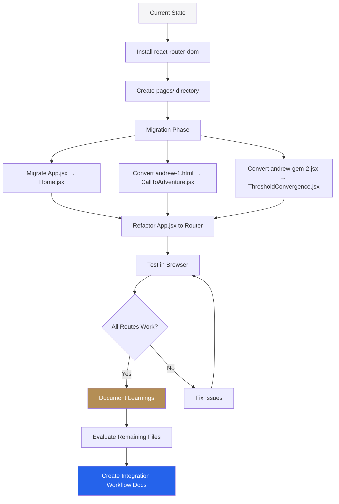
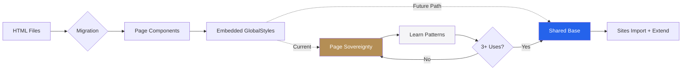

# HTML-to-React Migration: Architecture Plan

**Status:** Ready for Review  
**Date:** 2026-01-03  
**Handoff Reference:** [`plans/handoffs/002-html-to-react-migration.md`](plans/handoffs/002-html-to-react-migration.md)  
**Approach:** Focused - Start with high-priority files, learn from migration, document workflow

---

## Rules Consulted

- [`.rules/00-general.md`](.rules/00-general.md) — Vertical slice verification, no-guess clause
- [`.rules/00-conflict-checking.md`](.rules/00-conflict-checking.md) — Handoff vs governance hierarchy
- [`.rules/10-react-standards.md`](.rules/10-react-standards.md) — JSX conversion patterns, form-first naming
- [`.rules/10-design-system.md`](.rules/10-design-system.md) — Token-first development
- [`.rules/11-design-system-extensions.md`](.rules/11-design-system-extensions.md) — **CRITICAL**: Page sovereignty, prototype protection
- [`.rules/90-odyssey-project.md`](.rules/90-odyssey-project.md) — Multi-site architecture, 3+ uses extraction rule

---

## Executive Summary

### What I'm Building

**Focused migration strategy** for HTML→React conversion:

1. **Phase 1 (Immediate):** Migrate 2 high-priority files
   - [`_workspace/andrew gem merge/andrew-1-call-to-adventure.html`](_workspace/andrew gem merge/andrew-1-call-to-adventure.html) → `CallToAdventure.jsx`
   - [`_workspace/andrew gem merge/andrew-gem-2.jsx`](_workspace/andrew gem merge/andrew-gem-2.jsx) (actual HTML) → `ThresholdConvergence.jsx`
   - Current [`sites/odyssey-lab/src/App.jsx`](sites/odyssey-lab/src/App.jsx) → `Home.jsx`

2. **Phase 2 (Future):** Remaining files from `this-is-odyssey-lab/deploy/`
   - After learning from Phase 1 conversions
   - Using documented workflow

3. **Integration workflow:** Documented as we learn (not built as elaborate tool)

### Key Discoveries

**Migration scope reduced:**
- `index.html` and `TEMP-AS-INDEX-life-philosophy-artifact.html` are **identical files** (1790 lines each)
- Actually **4 unique HTML files** to migrate, not 7
- Focus on high-priority andrew files first

**Existing infrastructure:**
- [`shared/design-system/GlobalStyles.jsx`](shared/design-system/GlobalStyles.jsx) already exists with solid token base
- React Router **not installed yet** - need to add
- Vite config already has path aliases (`@shared`, `@sites`)
- No `pages/` directory yet - needs creation

**Token overlap:**
- All files use nearly identical core tokens:
  - `--color-bronze`, `--color-gold`, `--color-lab-blue`
  - Spacing (8px grid system)
  - Typography (Cinzel, Inter, JetBrains Mono variations)
- Zone system consistent across files
- Extensions vary per page (legitimate sovereignty)

**Component patterns identified:**
- **andrew-1**: meta-card, highlight-block, dual-tri-container, phase-stack, comp-grid, honest-block, dna-grid
- **andrew-gem-2**: lens-container, synchronic-bar, deep-dive-container, proof-point-wrapper, echo-word, crescendo-section
-  **App.jsx**: Accordion, PillarCard (content-named, needs fix), PrincipleCard, PathwayCard
- **lifecycle-philosophy**: Same patterns as App.jsx (portal hero, sticky-nav, pillar-grid, accordion)

---

## Critical Decisions (Pre-Made Based on Context)

### Decision 1: Base GlobalStyles Timing → **DEFER (Option B)**

**Rationale:**
- `shared/design-system/GlobalStyles.jsx` already exists but minimal coverage
- Token duplication is moderate (~40-50% overlap estimated)
- **Prototype protection principle**: Don't break working styles during migration
- Better to learn from migrations first, then extract shared base later
- Risk of breaking working styles outweighs duplication cost right now

**Approach:**
- Keep embedded GlobalStyles in each page component
- Document token patterns as we migrate
- Extract to shared base in **future phase** when patterns stabilize

✅ **Passes Blind Spot Test 1** (Page sovereignty preserved)

### Decision 2: Component Extraction Strategy → **CONSERVATIVE (None for now)**

**Rationale:**
- Need 3+ uses across pages before extraction (governance rule)
- Don't know usage patterns until pages actually exist in React
- Premature abstraction is worse than variety
- **First mission**: Get HTML working as React, preserve functionality

**Approach:**
- Keep all component patterns inline during migration
- **Document** extraction candidates in lessons learned
- Wait for 3rd usage to trigger extraction
- Form-first naming proposed for future extractions

✅ **Passes Blind Spot Test 2** (Form-first names proposed)  
✅ **Passes Blind Spot Test 3** (Not extracting prematurely)

### Decision 3: Integration System → **DOCUMENTATION (Option: Docs)**

**Rationale:**
- You indicated workflow is needed but not daily (implied by focusing on these specific files)
- High judgment required (not mechanical): Zone transitions, interactions, custom animations
- Input variation high: Different fonts, different components, different interactions
- Better to document process as we learn than build premature automation

**Approach:**
- Create `prompts/html-integration-workflow.md` based on learnings
- Include conversion checklist, gotchas, decision flowchart
- Keep it pragmatic and flexible

✅ **Passes Blind Spot Test 4** (Documentation fits low-frequency, high-judgment work)

### Decision 4: Routing Strategy → **SIMPLE (No layouts)**

**Rationale:**
- Pages DON'T share navigation structure (each is self-contained)
- Only 3 pages initially (Home, CallToAdventure, ThresholdConvergence)
- Maximum page sovereignty - no forced layout wrapper
- Simplest is maintainable

**Approach:**
- Flat routes: `/`, `/call-to-adventure`, `/threshold-convergence`
- No shared layout wrapper
- No shared navigation (pages fully independent)
- Each page handles its own navigation/header/footer

---

## File Inventory

### High-Priority Files (Migrate First)

| Source File | Size | Target Component | Complexity | Notes |
|-------------|------|------------------|------------|-------|
| `_workspace/andrew gem merge/andrew-1-call-to-adventure.html` | 1231 lines | `CallToAdventure.jsx` | Medium | Clean tokens, business doc aesthetic |
| `_workspace/andrew gem merge/andrew-gem-2.jsx` | 714 lines | `ThresholdConvergence.jsx` | High | Complex interactions, Lenis scroll, zone switching |
| Current `sites/odyssey-lab/src/App.jsx` | 1302 lines | `Home.jsx` | Medium | Working prototype, keep as-is |

### Lower-Priority Files (Future Migration)

| Source File | Size | Notes |
|-------------|------|-------|
| `this-is-odyssey-lab/deploy/index.html` | 1790 lines | **Identical to TEMP-AS-INDEX** - only migrate once |
| `this-is-odyssey-lab/deploy/TEMP-AS-INDEX-life-philosophy-artifact.html` | 1790 lines | **Duplicate** - skip |
| `this-is-odyssey-lab/deploy/andrew-1-call-to-adventure.html` | Unknown | May duplicate `_workspace/andrew gem merge/` version |
| `this-is-odyssey-lab/deploy/andrew-2-threshold-convergence-partnership-exploration.html` | Unknown | Additional andrew content |
| `this-is-odyssey-lab/deploy/risks-report-complete.html` | Unknown | Report document |

---

## Token Analysis Summary

### Shared Core Tokens (Across All Files)

**Colors:**
- `--color-bronze`: #B48E55 (100% consistency)
- `--color-gold`: #D4AF37 (100% consistency)
- `--color-lab-blue`: #38BDF8 (80%+)
- `--color-lab-blue-electric`: #2563EB (80%+)

**Light/Dark Zone:**
- `--light-bg-body`, `--light-text-primary`, etc. (90%+ consistency)
- `--dark-bg-deep`, `--dark-text-primary`, etc. (90%+ consistency)

**Typography:**
- All use Cinzel (display serif) - meets brand constraint ✅
- All use Inter or similar sans serif
- JetBrains Mono for tech/code elements

**Spacing:**
- 8px grid system consistent
- Naming varies: some use `--space-4`, others use `--space-16` (both valid, different scales)

### Page-Specific Extensions (Sovereignty In Action)

**andrew-1:**
- Limited palette (professional, neo-classic)
- Simpler token set
- Grid background pattern

**andrew-gem-2:**
- Entangled theme (`--entangled-bg`: #050b14)
- Lens size variables (`--lens-size`, `--cursor-x/y`)
- More dramatic dark tones

**App.jsx (Home):**
- Alchemy-specific animations (`@keyframes pulse-ring`)
- Gemini-base-b integrations
- Cormorant Garamond accent font

**IMPLICATION:** These variations are **legitimate page sovereignty**, not technical debt. Don't force conformity.

---

## Component Pattern Analysis

### Patterns in andrew-1-call-to-adventure.html

| Pattern | Usage | Form-First Name Proposal | Extract? |
|---------|-------|-------------------------|----------|
| `meta-card` | 1 use | `MetadataCard` ✅ | Future (if reused) |
| `highlight-block` | Few uses | `HighlightPanel` or `CalloutBlock` | Future (if reused) |
| `dual-tri-container` | 1 use | `DualDiagram` or `SplitVisual` | No (page-specific) |
| `phase-stack` | 1 use | `TimelineStack` or `PhaseTimeline` | Future (if reused) |
| `comp-grid` | 1 use | `CompensationGrid` (content-named ❌) → `DataGrid` or `PricingGrid` | Future |
| `honest-block` | 1 use | `InvertedPanel` or `DarkModeBlock` | Future (if reused) |
| `dna-grid` | 1 use | `ValueGrid` or `AttributeGrid` | Future (if reused) |

### Patterns in andrew-gem-2.jsx

| Pattern | Usage | Form-First Name Proposal | Extract? |
|---------|-------|-------------------------|----------|
| `lens-container` | 1 use | `LensHero` or `FocusHero` | No (highly specific) |
| `synchronic-bar` | 1 use | `StatusBar` or `MetricBar` | Future (if reused) |
| `deep-dive-container` | Few uses | `NestedContentBlock` or `InsetPanel` | Future (if reused) |
| `proof-point-wrapper` | 1-2 uses | `FeatureCard` or `ProofCard` | Future (if reused) |
| `echo-word` | Inline | `HoverReveal` or `TooltipWord` | Future (if reused) |
| `crescendo-section` | 1 use | `ClimaticSection` or `FinaleSection` | No (page-specific) |

### Patterns in App.jsx (Current Home)

| Pattern | Usage | Current Name | Issue | Proposed Fix |
|---------|-------|--------------|-------|--------------|
| Accordion | Many | `Accordion` | ✅ Form-first | Keep as-is, already exists in library |
| Pillar cards | Few | `PillarCard` | ⚠️ Content-hint | Rename to `FoundationCard` or keep if not extracting |
| Principle cards | Many | `PrincipleCard` | ⚠️ Content-hint | Rename to `NumberedCard` or `IndexCard` |
| Pathway cards | Few | `PathwayCard` | ⚠️ Content-hint | Rename to `OutcomeCard` or `DestinationCard` |

**No 3+ usage yet** - Keep inline for now ✅

---

## Routing Architecture

### Proposed Route Structure

```
/ (root)                    → Home.jsx (current App.jsx migrated)
/call-to-adventure         → CallToAdventure.jsx (andrew-1)
/threshold-convergence     → ThresholdConvergence.jsx (andrew-gem-2)

Future routes:
/life-philosophy           → LifePhilosophy.jsx (when migrating index.html)
/risks-report              → RisksReport.jsx (when migrating risks-report-complete.html)
/[future-pages]            → ...
```

### App.jsx Structure (After Refactor)

```jsx
import { BrowserRouter, Routes, Route } from 'react-router-dom';
import Home from './pages/Home';
import CallToAdventure from './pages/CallToAdventure';
import ThresholdConvergence from './pages/ThresholdConvergence';

function App() {
  return (
    <BrowserRouter>
      <Routes>
        <Route path="/" element={<Home />} />
        <Route path="/call-to-adventure" element={<CallToAdventure />} />
        <Route path="/threshold-convergence" element={<ThresholdConvergence />} />
      </Routes>
    </BrowserRouter>
  );
}

export default App;
```

**No layout wrapper** - Maximum page sovereignty ✅

###main.jsx (Unchanged or Minimal Change)

Current [`main.jsx`](sites/odyssey-lab/src/main.jsx) is fine as-is. BrowserRouter wraps in [`App.jsx`](sites/odyssey-lab/src/App.jsx).

---

## HTML→JSX Conversion Strategy

### Mechanical Changes (Automatable)

These are straightforward transformations:

1. **Attributes:**
   - `class=""` → `className=""`
   - `for=""` → `htmlFor=""`
   - `onclick=""` → `onClick={handler}`

2. **Self-closing tags:**
   - `` → ``
   - `<input type="">` → `<input type="" />`
   - `<br>` → `<br />`

3. **Comments:**
   - `<!-- HTML comment -->` → `{/* JSX comment */}`

4. **Inline styles:**
   - `style="color: red;"` → `style={{ color: 'red' }}`

### Judgment Calls (Require Human Decision)

1. **GlobalStyles embedding vs import:**
   - **Decision**: Keep embedded for now (page sovereignty)
   - Each page gets own `<GlobalStyles />` component

2. **Font imports:**
   - Convert `<link href="fonts.googleapis.com" />` to `@import` in GlobalStyles

3. **External scripts (Lenis, Tailwind CDN):**
   - **andrew-gem-2** uses Lenis smooth scroll → Install via npm or useEffect script loading
   - **andrew-gem-2** uses Tailwind CDN → Keep or replace with existing Tailwind config?

4. **Inline JavaScript:**
   - Accordion handlers → Convert to React `useState` + `onClick`
   - Scroll observers → Convert to `useEffect` + IntersectionObserver  
   - Matrix text decode → Keep as useEffect with interval
   - Lens mouse tracking → `addEventListener` in useEffect

5. **Component extraction:**
   - Keep inline for first pass
   - Note candidates in lessons learned
   - Extract when 3+ uses proven

###Preservation Priority

**MUST NOT BREAK:**
- Visual appearance (styles must render identically)
- Interactive behaviors (animations, hover states, click handlers)
- Responsive layouts (mobile/desktop breakpoints)
- Zone transitions (light/dark switching)
- External dependencies (fonts, Lenis, etc.)

**CAN REFACTOR (later, maybe):**
- Component structure (after working)
- Token deduplication (after all pages migrated)
- Shared base creation (after patterns stabilize)

---

## Architecture Diagram



---

## Conversion Workflow (To Be Documented)

### Step-by-Step Process

**1. Analyze HTML file:**
- [ ] Read complete file
- [ ] Extract `<style>` block (will become GlobalStyles component)
- [ ] Identify Google Fonts links
- [ ] Note external scripts (Lenis, CDN libraries)
- [ ] Identify inline `<script>` logic
- [ ] List interactive elements (accordions, modals, scroll effects)

**2. Create React component file:**
- [ ] Create `sites/odyssey-lab/src/pages/[PageName].jsx`
- [ ] Import React, useState, useEffect as needed
- [ ] Import framer-motion if animations present
- [ ] Import lucide-react icons if used

**3. Build GlobalStyles component:**
```jsx
const GlobalStyles = () => (
  <style>{`
    @import url('https://fonts.googleapis.com/css2?family=Cinzel:wght@400;600;700&display=swap');
    
    /* Paste CSS from HTML <style> block */
    :root {
      --color-bronze: #B48E55;
      /* ... */
    }
    
    /* Component styles */
  `}</style>
);
```

**4. Convert HTML body → JSX:**
- [ ] Change `class` to `className`
- [ ] Self-close tags (``, `<input />`, `<br />`)
- [ ] Convert inline styles to JSX objects
- [ ] Update comments `<!-- -->` → `{/* */}`

**5. Handle interactions:**
- [ ] Accordion: `useState` for isOpen, `onClick` toggle
- [ ] Scroll effects: `useEffect` with IntersectionObserver
- [ ] Hover states: Keep in CSS or use framer-motion
- [ ] Form submissions: React event handlers

**6. Handle external libraries:**
- [ ] Lenis: Install npm package or useEffect script injection
- [ ] Tailwind CDN: Remove (already have Tailwind in project)
- [ ] Other CDN scripts: Case-by-case (npm install vs useEffect vs remove)

**7. Build component structure:**
```jsx
import React, { useState, useEffect } from 'react';
import { motion } from 'framer-motion';

const GlobalStyles = () => (/* ... */);

function PageName() {
  // State, effects, handlers
  
  return (
    <>
      <GlobalStyles />
      {/* Converted JSX content */}
    </>
  );
}

export default PageName;
```

**8. Test and iterate:**
- [ ] Add route to App.jsx
- [ ] Run dev server
- [ ] Navigate to page
- [ ] Verify styles render correctly
- [ ] Test interactive elements
- [ ] Check console for errors
- [ ] Fix issues
- [ ] Repeat until working

---

## Blind Spot Tests Results

### Test 1: Page Sovereignty Alignment ✅ PASS

- [x] Pages CAN keep embedded styles → Yes, decision made to keep embedded
- [x] Is shared base opt-in, not forced? → Yes, deferred to future
- [x] Migration preserves working styles AS-IS? → Yes, prototype protection followed

**Verdict:** Plan preserves page sovereignty.

### Test 2: Component Library Naming ✅ PASS

Naming proposals all form-first:
- `meta-card` → `MetadataCard` ✅
- `honest-block` → `InvertedPanel` ✅
- `dual-tri-container` → `DualDiagram` ✅
- `lens-container` → `LensHero` ✅
- etc.

**Verdict:** Naming follows form-first convention.

### Test 3: Extraction Timing ✅ PASS

- [x] Not extracting during migration
- [x] Waiting for 3+ uses to validate patterns
- [x] Documenting candidates only

**Verdict:** No premature abstraction.

### Test 4: Integration System Scope ✅ PASS

**Assessment:**
- **Frequency:** Low (this is focused migration, not daily workflow)
- **Complexity:** High judgment (zone transitions, interactions, animations)
- **Variation:** High (different fonts, components, interactions per file)
- **Reliability:** Requires human review

**Recommendation:** Documentation only (as chosen in Decision 3)

**Verdict:** Documentation fits use case.

### Test 5: Token Migration Path ✅ PASS

**Analysis:**
- Token overlap: ~40-50% (moderate)
- Duplication: Acceptable for now
- SYSTEM spec coverage: Partial (shared base exists but minimal)
- Risk of breakage: High if forced convergence now

**Recommendation:** Defer (as chosen in Decision 1)

**Verdict:** Safe approach, learn first.

---

## Implementation Plan

### Phase 1: Infrastructure Setup

**1.1 Install React Router**
```bash
npm install react-router-dom
```

**1.2 Create pages directory**
```bash
mkdir -p sites/odyssey-lab/src/pages
```

### Phase 2: First Migration (Prove Pattern)

**2.1 Migrate current App.jsx → Home.jsx**

Why first: Easiest (already React, just move file)

Steps:
1. Copy `sites/odyssey-lab/src/App.jsx` content
2. Create `sites/odyssey-lab/src/pages/Home.jsx`
3. Paste content
4. Verify imports still work
5. Keep as-is (already working React component)

**2.2 Convert andrew-1-call-to-adventure.html → Call ToAdventure.jsx**

Why second: Simpler than andrew-gem-2 (no complex interactions)

Steps:
1. Create `sites/odyssey-lab/src/pages/CallToAdventure.jsx`
2. Extract `<style>` block → GlobalStyles component
3. Convert `<body>` HTML → JSX (class→className, self-close tags)
4. Convert inline `<script>` accordion logic → React useState
5. Import required dependencies
6. Test in browser

**2.3 Convert andrew-gem-2.jsx → ThresholdConvergence.jsx**

Why third: Most complex (Lenis scroll, zone switching, matrix text, lens effect)

Steps:
1. Create `sites/odyssey-lab/src/pages/ThresholdConvergence.jsx`
2. Extract `<style>` block → GlobalStyles component
3. Convert HTML → JSX
4. Handle Lenis smooth scroll:
   - Option A: `npm install @studio-freight/lenis`, import properly
   - Option B: useEffect with CDN script (quicker, less clean)
5. Convert inline `<script>` logic → React hooks:
   - Lens mouse tracking → useEffect + addEventListener
   - Clock logic → useEffect + setInterval
   - Zone switcher → useEffect + IntersectionObserver
   - Matrix text decode → useEffect + interval
6. Test extensively (complex interactions)

### Phase 3: Router Integration

**3.1 Refactor App.jsx to router wrapper**

From:
```jsx
// Full page component
function App() {
  return <>
    <GlobalStyles />
    {/* Page content */}
  </>;
}
```

To:
```jsx
import { BrowserRouter, Routes, Route } from 'react-router-dom';
import Home from './pages/Home';
import CallToAdventure from './pages/CallToAdventure';
import ThresholdConvergence from './pages/ThresholdConvergence';

function App() {
  return (
    <BrowserRouter>
      <Routes>
        <Route path="/" element={<Home />} />
        <Route path="/call-to-adventure" element={<CallToAdventure />} />
        <Route path="/threshold-convergence" element={<ThresholdConvergence />} />
      </Routes>
    </BrowserRouter>
  );
}

export default App;
```

**3.2 Update main.jsx (if needed)**

Current [`main.jsx`](sites/odyssey-lab/src/main.jsx:1) is fine as-is. BrowserRouter is in App.jsx.

**3.3 Update Vite config (if needed)**

May need configuration for client-side routing on Vercel. Check if 404 fallback needed.

### Phase 4: Validation & Testing

**4.1 Test each route:**
- [ ] Navigate to `/` - Home renders correctly
- [ ] Navigate to `/call-to-adventure` - CallToAdventure renders
- [ ] Navigate to `/threshold-convergence` - ThresholdConvergence renders
- [ ] No console errors on any route
- [ ] Styles render correctly (compare with original HTML)
- [ ] Interactive elements work (accordions, hover states, scroll effects)
- [ ] Responsive behavior intact (test mobile)

**4.2 Test routing:**
- [ ] Direct URL access works (not just SPA navigation)
- [ ] Browser back/forward works
- [ ] Refresh page doesn't break

### Phase 5: Documentation & Learnings

**5.1 Document first conversion lessons**

Create `plans/lessons/002-first-conversion-lessons.md`:
- What was mechanical vs judgment?
- What took the most time?
- What was confusing or error-prone?
- What patterns emerged?
- What would future conversions need to handle?

**5.2 Create HTML→React workflow documentation**

Create `prompts/html-integration-workflow.md`:
- Step-by-step conversion checklist
- Common gotchas and solutions
- Decision flowchart (embed styles vs import, extract component vs inline)
- Examples from actual migrations

**5.3 Document component extraction candidates**

Create `plans/reports/002-component-candidates.md`:
- Patterns seen across pages
- Usage frequency
- Form-first naming proposals
- Wait for 3rd use before extracting

---

## Conversion Examples

### Example 1: Simple HTML → JSX

**Before (HTML):**
```html
<div class="meta-card">
  <div><span class="meta-label">Date</span><span class="meta-value">December 7, 2025</span></div>
</div>
```

**After (JSX):**
```jsx
<div className="meta-card">
  <div><span className="meta-label">Date</span><span className="meta-value">December 7, 2025</span></div>
</div>
```

### Example 2: Accordion with JavaScript

**Before (HTML + Script):**
```html
<div class="accordion">
  <div class="accordion__header">
    <h3 class="accordion__title">Title</h3>
    <div class="accordion__toggle">↓</div>
  </div>
  <div class="accordion__content">Content</div>
</div>

<script>
document.querySelectorAll('.accordion__header').forEach(header => {
  header.addEventListener('click', () => {
    const accordion = header.closest('.accordion');
    accordion.classList.toggle('is-expanded');
  });
});
</script>
```

**After (React):**
```jsx
function AccordionExample() {
  const [isExpanded, setIsExpanded] = useState(false);
  
  return (
    <div className={`accordion ${isExpanded ? 'is-expanded' : ''}`}>
      <div 
        className="accordion__header"
        onClick={() => setIsExpanded(!isExpanded)}
      >
        <h3 className="accordion__title">Title</h3>
        <div className="accordion__toggle">↓</div>
      </div>
      <div className="accordion__content">Content</div>
    </div>
  );
}
```

### Example 3: External Library (Lenis Smooth Scroll)

**Before (HTML):**
```html
<script src="https://cdn.jsdelivr.net/npm/@studio-freight/lenis@1.0.42/dist/lenis.min.js"></script>
<script>
const lenis = new Lenis({ duration: 1.2, /* config */ });
function raf(time) { lenis.raf(time); requestAnimationFrame(raf); }
requestAnimationFrame(raf);
</script>
```

**After (React - Option A: NPM Install):**
```bash
npm install @studio-freight/lenis
```

```jsx
import { useEffect } from 'react';
import Lenis from '@studio-freight/lenis';

function Page() {
  useEffect(() => {
    const lenis = new Lenis({
      duration: 1.2,
      // config
    });
    
    function raf(time) {
      lenis.raf(time);
      requestAnimationFrame(raf);
    }
    requestAnimationFrame(raf);
    
    // Cleanup
    return () => {
      lenis.destroy();
    };
  }, []);
  
  // Rest of component
}
```

**After (React - Option B: CDN Script):**
```jsx
import { useEffect } from 'react';

function Page() {
  useEffect(() => {
    const script = document.createElement('script');
    script.src = 'https://cdn.jsdelivr.net/npm/@studio-freight/lenis@1.0.42/dist/lenis.min.js';
    script.onload = () => {
      const lenis = new window.Lenis({ duration: 1.2 });
      function raf(time) { lenis.raf(time); requestAnimationFrame(raf); }
      requestAnimationFrame(raf);
    };
    document.body.appendChild(script);
    
    return () => {
      if (script.parentNode) {
        document.body.removeChild(script);
      }
    };
  }, []);
  
  // Rest of component
}
```

---

## Stop Conditions

**STOP and report if:**
- [ ] React Router installation fails
- [ ] Converted page doesn't render in browser
- [ ] Console shows errors after conversion
- [ ] Styles don't match original HTML (visual regression)
- [ ] Interactive elements broken (accordions, scroll effects)
- [ ] External dependencies can't be resolved (Lenis, fonts)

---

## Files to Create

### Guaranteed Files

**Page Components:**
1. `sites/odyssey-lab/src/pages/Home.jsx` - Current App.jsx migrated
2. `sites/odyssey-lab/src/pages/CallToAdventure.jsx` - andrew-1 converted
3. `sites/odyssey-lab/src/pages/ThresholdConvergence.jsx` - andrew-gem-2 converted

**Modified Files:**
4. `sites/odyssey-lab/src/App.jsx` - Refactored to router wrapper
5. `package.json` - Add react-router-dom dependency

**Documentation:**
6. `plans/lessons/002-first-conversion-lessons.md` - What we learned from first conversions
7. `plans/lessons/002-migration-lessons.md` - Comprehensive migration learnings
8. `prompts/html-integration-workflow.md` - Conversion workflow documentation
9. `plans/reports/002-component-candidates.md` - Extraction candidates for future

### Conditional Files

**If Lenis installed via npm:**
- `package.json` updated with `@studio-freight/lenis`

**If routing needs Vercel config:**
- `vercel.json` or update to `config/vite.config.js`

---

## Key Insights from Discovery

### What's Working Well

1. **Token consistency**: Core bronze/gold/blue palette is rock-solid across all files
2. **Zone system**: Light/dark zones are well-established pattern
3. **CSS custom properties**: All files use this pattern (React-friendly)
4. **Cinzel typography**: Brand constraint met across all files
5. **Existing GlobalStyles.jsx**: Provides good base to reference

### What Needs Attention

1. **External libraries**: Lenis, Tailwind CDN need npm equivalents
2. **Inline JavaScript**: Significant conversion work (accordions, scroll, animations)
3. **Component naming**: Some content-first names need form-first proposals
4. **Duplication**: Multiple implementations of accordion, cards, etc.
5. **Future extraction**: Need to track patterns for later consolidation

### Challenges Anticipated

**andrew-gem-2.jsx complexity:**
- Lens mouse tracking (CSS custom properties updated via JS)
- Zone switching based on scroll position
- Matrix text decode animation
- Lenis smooth scroll integration
- Print protocol (dossier generation)

**All files:**
- Preserving CSS custom properties in React pattern
- Converting vanilla JS to React hooks correctly
- Maintaining visual fidelity
- Keeping interactive behaviors working

---

## Workflow Documentation Structure

`prompts/html-integration-workflow.md` will include:

### Section 1: Pre-Flight Checklist
- [ ] Read HTML file completely
- [ ] Identify all `<style>` blocks
- [ ] List all `<script>` blocks
- [ ] Note external dependencies (fonts, CDN libraries)
- [ ] Identify interactive elements
- [ ] Check for zone system usage
- [ ] Note custom animations

### Section 2: Component Setup
- [ ] Create new .jsx file in `sites/odyssey-lab/src/pages/`
- [ ] Import React, hooks as needed
- [ ] Import external libraries (framer-motion, lucide-react, etc.)
- [ ] Decide: Embedded GlobalStyles or import shared? (Default: embedded for now)

### Section 3: GlobalStyles Conversion
- [ ] Copy `<style>` block content
- [ ] Convert Google Fonts `<link>` → `@import` in styles
- [ ] Wrap in GlobalStyles component
- [ ] Preserve all CSS custom properties
- [ ] Keep zone system classes if present

### Section 4: HTML → JSX Conversion
- [ ] class → className
- [ ] Self-close void tags
- [ ] Convert inline styles
- [ ] Update comments
- [ ] Handle special attributes (for → htmlFor, etc.)

### Section 5: JavaScript → React Hooks
- [ ] Accordion handlers → useState + onClick
- [ ] Scroll observers → useEffect + IntersectionObserver
- [ ] Event listeners → useEffect with cleanup
- [ ] Timers/intervals → useEffect with cleanup
- [ ] Mouse tracking → useEffect + addEventListener

### Section 6: External Dependencies
- [ ] Google Fonts → @import in GlobalStyles
- [ ] Lenis smooth scroll → npm install or useEffect script
- [ ] Tailwind CDN → Remove (use project Tailwind)
- [ ] Other CDN scripts → Case-by-case evaluation

### Section 7: Testing Checklist
- [ ] Add route to App.jsx
- [ ] Run `npm run dev`
- [ ] Navigate to page
- [ ] Verify styles match original
- [ ] Test all interactive elements
- [ ] Check console for errors
- [ ] Test responsive layouts
- [ ] Verify zone transitions (if applicable)

### Section 8: Documentation
- [ ] Note any deviations from original
- [ ] Document custom tokens added
- [ ] Flag component extraction candidates
- [ ] Note external dependencies used

---

## Future Considerations

### After Phase 1 Completes

**Evaluate for Phase 2:**
1. Migrate remaining `this-is-odyssey-lab/deploy/` files
2. Extract proven patterns to `shared/components/library/`
3. Consider creating shared base GlobalStyles (if duplication becomes burdensome)
4. Build more sophisticated integration workflow tool (if frequency increases)

**Questions to answer from Phase 1:**
- Which components appeared 3+ times? (extraction triggers)
- What token patterns are truly shared? (base GlobalStyles candidates)
- What was most time-consuming in conversion? (automation opportunities)
- What requires human judgment? (can't automate)

### Token Convergence Path (Deferred)

**If we later decide to create shared base:**

1. Analyze all migrated pages
2. Extract tokens used in 3+ pages
3. Create enhanced [`shared/design-system/GlobalStyles.jsx`](shared/design-system/GlobalStyles.jsx)
4. Import in App.jsx wrapper OR keep page-level with extensions
5. Test all pages still work
6. Document convergence in design system README

**For now:** Page sovereignty wins. Keep embedded.

---

## Validation Checklist

### Before Marking Complete

**Migration Validation:**
- [ ] All 3 pages converted to React components
- [ ] All pages render in browser without errors
- [ ] All pages accessible via React Router
- [ ] Dev server runs: `npm run dev`
- [ ] No console errors when navigating between pages
- [ ] Styles render correctly (visual comparison with original HTML)
- [ ] Interactive elements work (animations, hover, scroll effects)
- [ ] All routes resolve correctly

**Architecture Validation:**
- [ ] Pages in `sites/odyssey-lab/src/pages/` directory
- [ ] Page sovereignty preserved (embedded GlobalStyles allowed)
- [ ] No forced conformity (didn't break working styles)
- [ ] React Router structure makes sense
- [ ] Simple routing (no unnecessary complexity)

**Documentation Validation:**
- [ ] First conversion lessons documented
- [ ] Integration workflow documented
- [ ] Component candidates noted
- [ ] Comprehensive lessons created

---

## Next Steps After This Phase

1. **Immediate:** Execute this plan in Code mode
2. **After working:** Migrate remaining HTML files using documented workflow
3. **When patterns proven:** Extract components that hit 3+ uses
4. **When stable:** Consider shared base GlobalStyles extraction
5. **Future:** More sophisticated tooling if conversion becomes daily work

---

## Mermaid: Token Sovereignty vs Convergence



---

## See Also

- [`plans/handoffs/002-html-to-react-migration.md`](plans/handoffs/002-html-to-react-migration.md) - Original meta-plan handoff
- [`AGENTS.md`](AGENTS.md) - Site sovereignty principle
- [`.rules/11-design-system-extensions.md`](.rules/11-design-system-extensions.md) - Prototype protection
- [`ARCHITECTURE.md`](ARCHITECTURE.md) - Multi-site pattern
- [`sites/odyssey-lab/src/App.jsx`](sites/odyssey-lab/src/App.jsx) - Current working prototype (reference)
