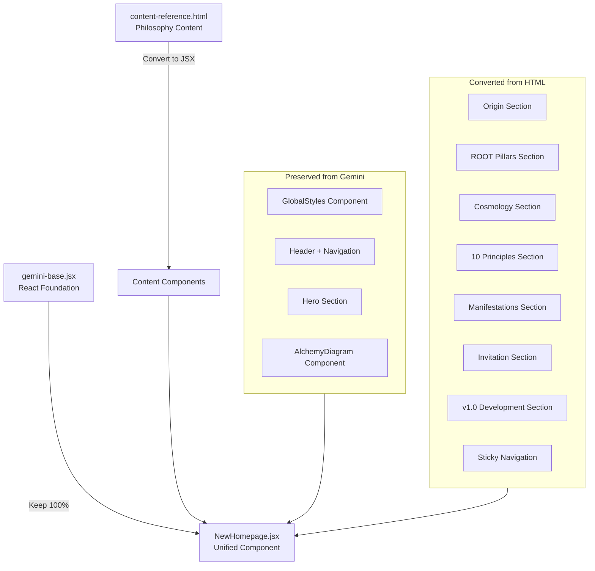

# Merge gemini-base.jsx + content-reference.html into Unified React Component

## SETUP COMPLETE - READY FOR CONTENT MIGRATION

### Completed (Jan 2, 2026)
- **Phase 1: Setup & Environment** - COMPLETE
- **Phase 2: Style Integration & Zone System** - COMPLETE (CSS syntax fixed)
- **NewHomepage.jsx Reset**: Clean gemini-base.jsx foundation (lines 1-345)
- **Vite + Tailwind v3.4.19**: Configured and working
- **Dev Server Running**: `http://localhost:5174/`
- **Browser Verified**: All base styles, header, hero section rendering correctly
- **All Base Elements Working**: 
  - Header with logo, navigation, "System: Flourishing"
  - "LIFE PHILOSOPHY V1" badge
  - "THE ALCHEMY OF BEING" title with gold gradient
  - "THE INQUIRY" section with philosophical quote
  - "FRAMEWORK DEFINITION" with Integration Alchemy description
  - "BEGIN JOURNEY" scroll indicator

### Known Issue (Optional)
- **Responsive Grid Layout**: Not working at lg breakpoint (1024px+)
- **Behavior**: Layout stacks vertically at all widths instead of 3-column grid
- **Expected**: 3-column grid with center "TRANSMUTATION" axis at desktop widths
- **Status**: NOT BLOCKING - Can be addressed after content migration

### Next Steps
- **See**: `plans/GEMINI_CONTENT_MIGRATION_PLAN.md` for focused execution plan
- **Focus**: Migrate remaining content from content-reference.html into NewHomepage.jsx
- **Preserve**: Lines 1-345 of NewHomepage.jsx (complete working base)

---

## Executive Summary

This plan merges [`_workspace/init gem content delta test/gemini-base.jsx`](_workspace/init gem content delta test/gemini-base.jsx) (React foundation, nav, hero) with [`_workspace/init gem content delta test/content-reference.html`](_workspace/init gem content delta test/content-reference.html) (philosophy content) into a complete React component. **CRITICAL: gemini-base.jsx is sacrosanct—zero changes to its existing structure, styles, or components.**

## Architecture Overview



## Content Preservation Matrix

### From gemini-base.jsx (PRESERVE 100%)
- ✅ All imports (React, useState, useEffect, framer-motion, lucide-react)
- ✅ GlobalStyles component (CSS variables, animations, grid patterns)
- ✅ NavLink component
- ✅ DecorationNode component
- ✅ AlchemyDiagram component
- ✅ Full Header structure (logo, navigation, version badge)
- ✅ Complete Hero section (portal motif, split layout, transmutation axis)

### From content-reference.html (CONVERT TO JSX)

**Section 1: Origin Story** (Lines 714-777)
- Hero section already replaced by JSX version
- Origin Story content: philosophy book club, decade-long quest
- 2 Accordions: Epiphany #1 (Human Evolution App), Epiphany #2 (Political Platform)

**Section 2: The ROOT** (Lines 783-937)
- 3 Pillar Cards: Frankl, Tolle, Panpsychism
- Each pillar has nested accordion with expandable content
- Synthesis statement box

**Section 3: Cosmology** (Lines 940-1087)
- 4 Accordions: Universal Consciousness, Technology Threshold, Meaning-Making, Interconnection

**Section 4: 10 Principles** (Lines 1093-1241)
- 10 Principle cards in grid
- 1 Deep-dive accordion with complete framework

**Section 5: Manifestations** (Lines 1244-1478)
- 6 Accordions: Meta-Frameworks, IXD, Applied Methodologies, Cultural Expression, Product Visions, Business Operations

**Section 6: Invitation** (Lines 1481-1533)
- 4 Pathway cards
- Core message block

**Section 7: v1.0 Development** (Lines 1536-1646)
- 1 Accordion with open questions

**Interactive Elements** (Lines 1649-1769)
- Sticky bottom navigation (appears after hero scroll)
- Mobile navigation toggle
- Section highlighting on scroll
- All JavaScript accordion logic

## Component Architecture

### New Presentational Components to Create

```jsx
// 1. Accordion Component (reusable)
<Accordion 
  eyebrow="Category"
  title="Section Title" 
  description="Preview text"
  defaultExpanded={false}
>
  {children}
</Accordion>

// 2. PillarCard Component
<PillarCard
  number="Pillar #1"
  title="Viktor Frankl: Life Questions Us"
  essence="Life doesn't ask what meaning is..."
>
  {children} // Optional nested accordion
</PillarCard>

// 3. PrincipleCard Component
<PrincipleCard
  number={1}
  title="Know Thyself Foundation"
  essence="Self-knowledge precedes..."
/>

// 4. PathwayCard Component
<PathwayCard
  icon="🧭"
  title="For Personal Transmutation"
  description="If you're on your own Hero's Journey..."
/>

// 5. QuoteBlock Component
<QuoteBlock
  text="Quote content..."
  attribution="— Viktor Frankl"
/>

// 6. SynthesisBlock Component
<SynthesisBlock label="The Synthesis">
  {children}
</SynthesisBlock>

// 7. SectionHeader Component
<SectionHeader
  eyebrow="Where This Comes From"
  title="Origin Story: A Decade-Long Quest"
  description="This philosophy didn't start..."
/>

// 8. ZoneTransition Component
<ZoneTransition /> // Gradient transition between light/dark zones

// 9. StickyNav Component
<StickyNav sections={[...]} activeSection={current} />
```

## Execution Phases

### ✅ Phase 1: Setup & Environment (COMPLETE)
~~1. Start development server for visual testing~~
~~2. Create output file: `_workspace/init gem content delta test/NewHomepage.jsx`~~
~~3. Copy entire gemini-base.jsx as starting foundation~~
~~4. Verify dev server renders existing JSX correctly~~

### ✅ Phase 2: Style Integration & Zone System (COMPLETE)
~~1. **Merge CSS Variables** from HTML into GlobalStyles~~
~~2. **Add Zone System Classes** to GlobalStyles~~
~~3. **Import Additional CSS Patterns**~~

---

## 🚀 BEGIN HERE: Phase 3 - Component Implementation

**Your starting point:**
- File: `_workspace/init gem content delta test/NewHomepage.jsx`
- Dev server: Running on `http://localhost:5174/`
- Current state: Lines 1-487 contain complete base with header, hero, and merged styles
- Browser: Open and verified working

**Your task:** Build the remaining components and add all content sections.

### Phase 3: Component Implementation
1. **Create Reusable Components** (in order of dependency)
   - `SectionHeader` (simplest, no dependencies)
   - `QuoteBlock` (simple presentational)
   - `Accordion` (interactive, useState for expand/collapse)
   - `PillarCard` (uses Accordion)
   - `PrincipleCard` (simple card)
   - `PathwayCard` (simple card)
   - `SynthesisBlock` (styled container)
   - `ZoneTransition` (gradient div)
   - `StickyNav` (complex: useState, useEffect, intersection observer)

2. **Add Required Icons** from lucide-react
   - Already have: Activity, Compass, Layers, ArrowRight, Maximize2, Minimize2, Circle, Hexagon, Triangle
   - May need: Check for any icon references in HTML content

### Phase 4: Content Migration (CRITICAL - 100% PRESERVATION)

**After existing hero section** (after line 342 in JSX), add:

1. **Origin Story Section** (zone-light)
   - Container with SectionHeader
   - Paragraphs converted to JSX
   - 2 Accordions for epiphanies
   - Preserve ALL text verbatim

2. **Zone Transition** (visual separator)
   - ZoneTransition component

3. **ROOT Section** (zone-dark)
   - SectionHeader
   - 3 PillarCards with nested Accordions
   - SynthesisBlock
   - Preserve ALL quotes, lists, emphasis

4. **Cosmology Section** (zone-dark continues)
   - SectionHeader
   - 4 Accordions
   - Preserve ALL content

5. **Zone Transition** (back to light)

6. **Principles Section** (zone-light)
   - SectionHeader
   - Grid of 10 PrincipleCards
   - 1 Accordion with deep-dive content
   - Preserve ALL principle text

7. **Manifestations Section** (zone-light continues)
   - SectionHeader
   - 6 Accordions
   - Preserve ALL methodology details

8. **Invitation Section** (zone-light gradient)
   - SectionHeader
   - 4 PathwayCards
   - Core message block
   - Preserve inspirational closing

9. **v1.0 Development Section** (zone-light muted)
   - SectionHeader
   - 1 Accordion with open questions
   - Essence closing block

10. **StickyNav Component** (fixed bottom)
    - Appears after hero scroll
    - Links to all major sections
    - Mobile toggle functionality

### Phase 5: Interactive Behavior Implementation

1. **Accordion Logic** (useState)
   - Each accordion tracks own expanded state
   - Click handler toggles expansion
   - Keyboard support (Enter/Space)
   - ARIA attributes (aria-expanded)

2. **Sticky Nav Logic** (useEffect)
   - IntersectionObserver on hero section
   - Show nav when hero scrolls out of view
   - Highlight active section on scroll
   - Mobile menu toggle state

3. **Scroll Behavior**
   - Section highlighting based on scroll position
   - Smooth scroll to anchors
   - Active link styling

### Phase 6: Visual Verification Checkpoints

**Checkpoint 1: Base Structure**
- ✅ Dev server runs without errors
- ✅ Header renders identically to original JSX
- ✅ Hero section renders identically to original JSX
- ✅ AlchemyDiagram animates correctly
- ✅ Navigation links have hover states

**Checkpoint 2: New Sections Render**
- ✅ Origin section visible with proper zone-light background
- ✅ ROOT section visible with zone-dark background
- ✅ Zone transitions create gradient effect
- ✅ All text content renders (no missing sections)

**Checkpoint 3: Component Functionality**
- ✅ All accordions expand/collapse on click
- ✅ Hover states work on cards
- ✅ Sticky nav appears after scrolling past hero
- ✅ Active section highlights in sticky nav
- ✅ Mobile nav toggle works (test at <768px width)

**Checkpoint 4: Style Coherence**
- ✅ Bronze/gold colors consistent throughout
- ✅ Cinzel font used for all headings
- ✅ Inter/Montserrat fonts match body text
- ✅ Spacing follows 8px grid system
- ✅ No color mismatches between zones
- ✅ Light zone: warm white background (#FFFDF7)
- ✅ Dark zone: deep navy background (#0F172A)

**Checkpoint 5: Content Completeness Audit**
- ✅ All 3 pillars present with full content
- ✅ All 10 principles present with correct numbers
- ✅ All 6 manifestation accordions present
- ✅ All quotes preserved with attribution
- ✅ All lists preserved with correct items
- ✅ No "Lorem Ipsum" or placeholder text
- ✅ Footer essence block present

**Checkpoint 6: Responsive Behavior**
- ✅ Test at 1920px (desktop): 3-column grids work
- ✅ Test at 768px (tablet): 2-column or 1-column grids
- ✅ Test at 375px (mobile): All content readable, nav toggles
- ✅ Touch targets adequate on mobile (44px minimum)

**Checkpoint 7: Animation & Interaction**
- ✅ Hero entrance animations play
- ✅ Scroll indicator pulses
- ✅ Alchemy diagram rotates continuously
- ✅ Card hover lifts work smoothly
- ✅ No animation jank or stuttering
- ✅ Framer Motion animations perform well

## Success Criteria

### Must-Have (Blocking)
1. **Zero Changes to JSX Base**: Header, Hero, existing components unchanged
2. **100% Content Preservation**: Every word from HTML present in JSX
3. **All Accordions Functional**: Click to expand/collapse works
4. **Sticky Nav Works**: Appears on scroll, highlights sections
5. **Zone System Works**: Light/dark backgrounds render correctly
6. **No Console Errors**: Clean browser console
7. **Responsive at 3 Breakpoints**: Desktop, tablet, mobile

### Should-Have (High Priority)
1. **Component Naming**: Presentational names (PillarCard not FranklCard)
2. **Code Organization**: Components defined before main App export
3. **Consistent Styling**: Uses CSS variables from GlobalStyles
4. **Accessibility**: ARIA labels, keyboard navigation
5. **Performance**: No rendering lag, smooth scrolling

### Nice-to-Have (Enhanceable Later)
1. **Additional Icons**: Replace emoji with Lucide icons where appropriate
2. **Enhanced Visuals**: Diagram elements for cosmology section
3. **Micro-interactions**: Additional hover effects
4. **Code Splitting**: Separate component files (future refactor)

## Risk Mitigation

**Risk 1: Content Loss During Conversion**
- **Mitigation**: Side-by-side diff check of HTML vs JSX output
- **Validation**: Word count comparison, section-by-section audit

**Risk 2: Style Conflicts Between Systems**
- **Mitigation**: JSX styles take precedence; add HTML patterns incrementally
- **Validation**: Visual regression at each checkpoint

**Risk 3: Interactive Features Break**
- **Mitigation**: Test each accordion/nav feature individually before moving on
- **Validation**: Functional test checklist for all interactive elements

**Risk 4: Responsive Breakage**
- **Mitigation**: Test at each breakpoint after adding new sections
- **Validation**: Browser dev tools responsive mode testing

**Risk 5: Animation Performance Issues**
- **Mitigation**: Monitor frame rate, throttle animations if needed
- **Validation**: Chrome DevTools Performance profiling

## Development Environment Setup

```bash
# Install dependencies if not present
npm install react react-dom framer-motion lucide-react

# Start dev server (adjust command for your setup)
npm run dev
# OR
npx vite
# OR  
npx parcel _workspace/init\ gem\ content\ delta\ test/NewHomepage.jsx

# Open in browser
open http://localhost:3000 # (adjust port as needed)
```

## Content Verification Checklist

**Origin Section**
- [ ] Paragraph: "For nearly a decade, I've gathered with friends..."
- [ ] Epiphany #1: Human Evolution & Inner Alchemy App full text
- [ ] Epiphany #2: Political Accountability & Democracy Platform full text
- [ ] Closing: "What follows isn't just 'business philosophy'..."

**ROOT Section**
- [ ] Pillar #1: Viktor Frankl complete with quotes and accordions
- [ ] Pillar #2: Eckhart Tolle complete with bullet lists
- [ ] Pillar #3: Panpsychism complete with core metaphysics
- [ ] Synthesis statement: "Together they mean..." full text

**Cosmology Section**
- [ ] Universal Consciousness accordion complete
- [ ] Technology Threshold accordion complete
- [ ] Meaning-Making accordion complete (3 false paths, real path)
- [ ] Interconnection vs Separateness accordion complete

**Principles Section**
- [ ] All 10 principle cards with correct titles and essence text
- [ ] Deep-dive accordion with full application details for each principle

**Manifestations Section**
- [ ] Meta-Frameworks: AQAL and Personality Architecture details
- [ ] IXD: Integrated Experience Design principles
- [ ] Applied Methodologies: Design Your Life, Hero's Journey, Year Compass
- [ ] Cultural Expression: Brand metaphors and language choices
- [ ] Product Visions: Human Evolution App, Political Platform details
- [ ] Business Operations: Multi-stakeholder optimization, proof of concept

**Invitation Section**
- [ ] 4 pathway cards: Personal Transmutation, Business/Product, Consciousness Work, Scaling Impact
- [ ] Core message: "You are a node in universal consciousness..." complete
- [ ] Closing: "This is the way."

**v1.0 Development Section**
- [ ] All 8 open questions preserved
- [ ] Socratic dialogue path section
- [ ] Essence closing block with emojis: ✨🧭🌱🔥

## Recursive Verification Protocol

After each phase completion:
1. **Visual Check**: Load in browser, scroll through all sections
2. **Interaction Check**: Click every accordion, test sticky nav
3. **Console Check**: No errors or warnings
4. **Content Check**: Spot-check 3 random paragraphs against HTML source
5. **Responsive Check**: Toggle device mode, verify breakpoints
6. **Git Diff**: Review changes line-by-line before proceeding

After Phase 6 (final):
1. **Full Content Audit**: Check every section against checklist above
2. **Full Interaction Test**: Click every interactive element
3. **Full Responsive Test**: Test at 1920px, 1280px, 768px, 375px
4. **Performance Check**: Lighthouse score, no animation lag
5. **Cross-browser**: Test in Chrome, Firefox, Safari if possible
6. **Final Diff**: Compare word count HTML vs JSX (accounting for HTML tags)

## Notes for Gemini Execution

**CRITICAL PRESERVATION RULES**:
1. Copy **entire text content** from HTML—do not summarize, paraphrase, or truncate
2. Preserve **all emphasis** (strong, em tags → JSX equivalents)
3. Preserve **all lists** (ul, ol, li → JSX equivalents)  
4. Preserve **all quotes** verbatim with attribution
5. **Do not** alter gemini-base.jsx hero section, header, or existing components
6. **Do not** change color values in CSS variables (JSX versions are intentional)
7. **Do** convert HTML class names to className
8. **Do** convert inline styles to React style objects if needed
9. **Do** maintain semantic HTML5 structure (section, nav, header tags)
10. **Do** test in browser after each major section addition

**Component Naming Convention**:
- Name based on **presentation**, not content
- ✅ Good: `PillarCard`, `Accordion`, `PathwayCard`, `StickyNav`
- ❌ Bad: `FranklCard`, `EpiphanyAccordion`, `PersonalTransmutationCard`

**When in Doubt**:
- Preserve content over conciseness
- Keep original HTML structure where it works
- Add motion effects only if trivial (don't remove existing ones)
- Test in browser frequently
- Refer back to this plan's checkpoints

## Output File Specification

**Filename**: `_workspace/init gem content delta test/NewHomepage.jsx`

**Structure**:
```jsx
import React, { useState, useEffect } from 'react';
import { motion } from 'framer-motion';
import { /* icons */ } from 'lucide-react';

const GlobalStyles = () => (/* enhanced with HTML patterns */);

// Reusable Components
const SectionHeader = ({ eyebrow, title, description }) => (/* ... */);
const Accordion = ({ eyebrow, title, description, children, defaultExpanded }) => (/* ... */);
const PillarCard = ({ number, title, essence, children }) => (/* ... */);
const PrincipleCard = ({ number, title, essence }) => (/* ... */);
const PathwayCard = ({ icon, title, description }) => (/* ... */);
const QuoteBlock = ({ text, attribution }) => (/* ... */);
const SynthesisBlock = ({ label, children }) => (/* ... */);
const ZoneTransition = () => (/* ... */);
const StickyNav = ({ sections, activeSection }) => (/* ... */);

// Existing Components (preserved)
const NavLink = ({ children, active }) => (/* unchanged */);
const DecorationNode = ({ delay }) => (/* unchanged */);
const AlchemyDiagram = () => (/* unchanged */);

export default function App() {
  return (
    <div className="min-h-screen relative selection:bg-[var(--color-bronze-light)] selection:text-white">
      <GlobalStyles />
      
      {/* Background Layer - unchanged */}
      {/* Header - unchanged */}
      {/* Hero Section - unchanged */}
      
      {/* NEW CONTENT STARTS HERE */}
      <section id="origin" className="zone-light">
        {/* Origin Story */}
      </section>
      
      <ZoneTransition />
      
      <section id="root" className="zone-dark">
        {/* ROOT Pillars */}
      </section>
      
      {/* ... all remaining sections ... */}
      
      <StickyNav sections={[...]} />
    </div>
  );
}
```

**Estimated LOC**: ~2500-3000 lines (gemini-base: 345 + content conversion: ~2000 + components: ~500)

---

## Implementation Todos

- [ ] **env-setup**: Setup dev environment and start dev server for visual testing
- [ ] **create-output**: Create NewHomepage.jsx by copying gemini-base.jsx as foundation
- [ ] **merge-styles**: Merge CSS variables and zone system into GlobalStyles component
- [ ] **build-components**: Create all reusable presentational components (Accordion, Cards, etc) [depends on: create-output]
- [ ] **migrate-origin**: Convert and add Origin Story section with full content preservation [depends on: build-components]
- [ ] **migrate-root**: Convert and add ROOT section with 3 pillars and synthesis [depends on: migrate-origin]
- [ ] **migrate-cosmology**: Convert and add Cosmology section with 4 accordions [depends on: migrate-root]
- [ ] **migrate-principles**: Convert and add 10 Principles section with cards and deep-dive [depends on: migrate-cosmology]
- [ ] **migrate-manifestations**: Convert and add Manifestations section with 6 accordions [depends on: migrate-principles]
- [ ] **migrate-invitation**: Convert and add Invitation section with 4 pathway cards [depends on: migrate-manifestations]
- [ ] **migrate-v1dev**: Convert and add v1.0 Development section with closing essence [depends on: migrate-invitation]
- [ ] **implement-stickynav**: Implement StickyNav component with scroll behavior and mobile toggle [depends on: migrate-v1dev]
- [ ] **verify-interactions**: Test all interactive elements (accordions, nav, scroll behavior) [depends on: implement-stickynav]
- [ ] **verify-responsive**: Test responsive behavior at desktop, tablet, and mobile breakpoints [depends on: verify-interactions]
- [ ] **content-audit**: Complete content audit against verification checklist for 100% preservation [depends on: verify-responsive]
- [ ] **visual-regression**: Visual verification at all checkpoints for style coherence and animations [depends on: content-audit]

---

This plan ensures **zero risk** to the existing JSX foundation while systematically converting and integrating all HTML content with full preservation guarantees and multiple verification checkpoints.

