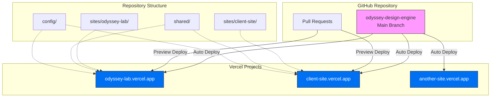
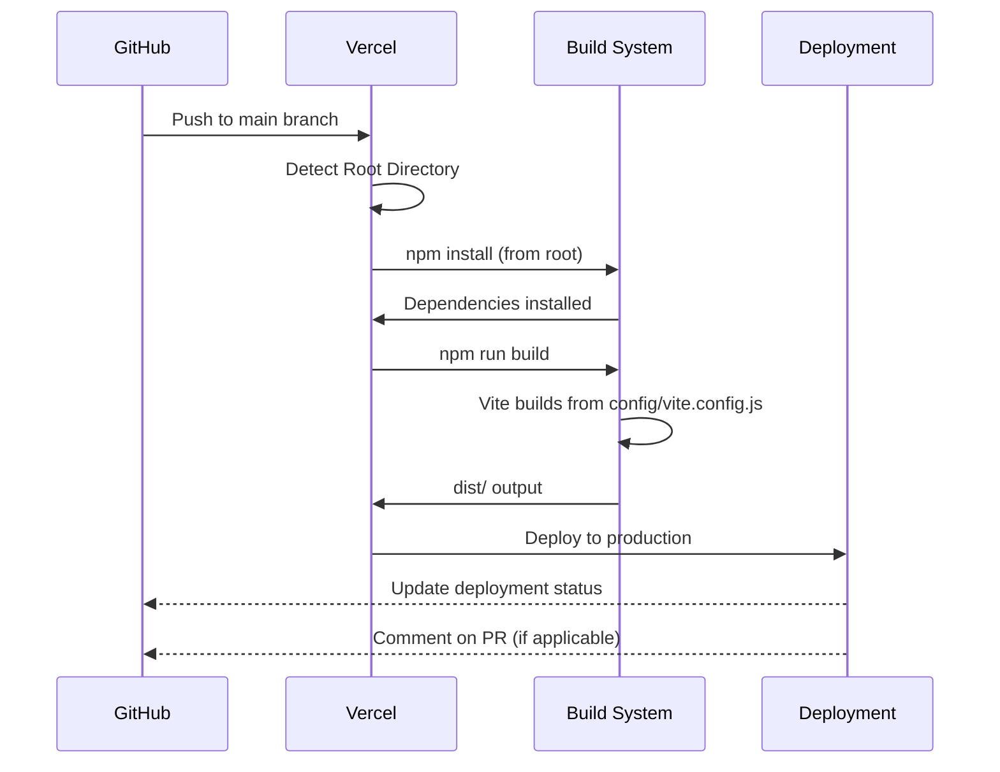
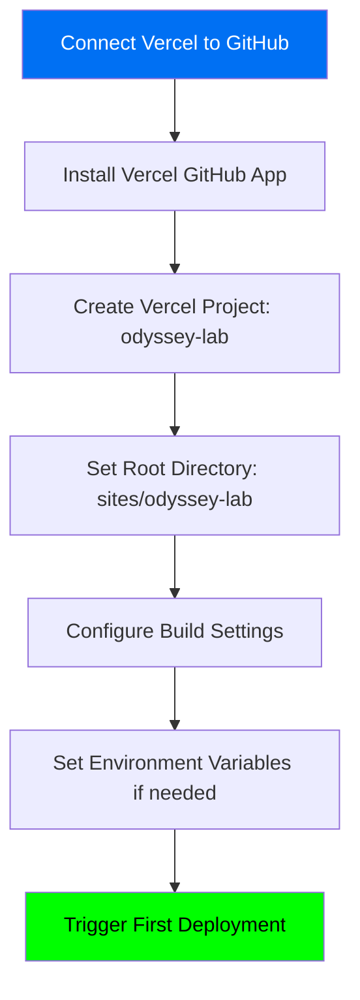
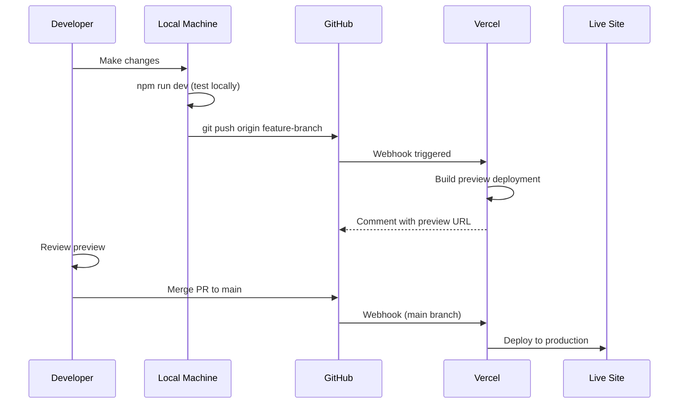
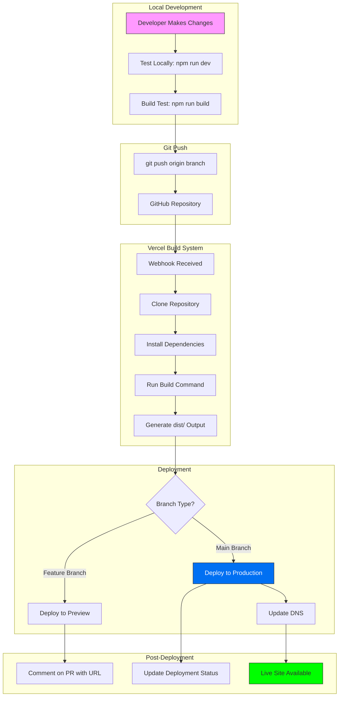

# Vercel + GitHub Deployment Requirements Research

**Date:** 2026-01-04  
**Research By:** Kilo Code (Ask Mode)  
**Purpose:** Determine deployment requirements for Odyssey Design Engine multi-site architecture via Vercel + GitHub integration  
**Research Duration:** ~30 minutes  
**Primary Sources:** Vercel official documentation (vercel.com/docs)

---

## Executive Summary

Vercel supports GitHub-integrated deployments for multi-site React architectures like the Odyssey Design Engine. Each site in `sites/` can be deployed as an **independent Vercel project** with automated CI/CD via GitHub. The system already has the necessary `vercel.json` configuration file; key requirements are GitHub repository connection, correct `rootDirectory` configuration per site, and understanding Vercel's build detection.

**Key Finding:** Your multi-site pattern (`sites/odyssey-lab/`, future `sites/client-site/`, etc.) aligns perfectly with Vercel's architecture — each site = one Vercel project with separate domain.

---

## System Architecture Overview



---

## GitHub Integration Requirements

### 1. Repository Connection

**Vercel supports these GitHub products:**
- ✅ GitHub Free
- ✅ GitHub Team
- ✅ GitHub Enterprise Cloud
- ✅ GitHub Enterprise Server *(with GitHub Actions)*

**Connection process:**
1. Link Vercel account to GitHub account (OAuth)
2. Grant Vercel app permissions to repository
3. Select repository: `odyssey-design-engine`
4. **Important:** Install Vercel GitHub App on the repository

**Permissions granted to Vercel:**
- Read repository code
- Read/write deployment statuses
- Create comments on pull requests (preview URLs)
- Access commit history

### 2. Automatic Deployments

**What triggers deployments:**
- ✅ Push to `main` branch → Production deployment
- ✅ Push to any branch → Preview deployment
- ✅ Pull request opened → Preview deployment with unique URL
- ✅ Pull request updated → New preview deployment (cancels in-progress builds)

**Build cancellation logic:**
- If Vercel is building commit A and commit B is pushed, commit A build is canceled
- Most recent commit always gets deployed
- Ensures latest changes deployed as quickly as possible

**Control deployment triggers:**
```json
{
  "github": {
    "autoJobCancellation": true,
    "enabled": true,
    "silent": false
  }
}
```

---

## Multi-Site Deployment Configuration

### Current File: `vercel.json`

Your project root currently has `vercel.json`. For multi-site architecture, you'll need **per-site configuration**.

**Pattern 1: Root-level vercel.json (Current)**
```json
{
  "buildCommand": "npm run build",
  "outputDirectory": "dist",
  "devCommand": "npm run dev",
  "installCommand": "npm install"
}
```

**Pattern 2: Per-Site Configuration (Recommended for Multi-Site)**

Each Vercel project should point to its site subdirectory:

**Vercel Project 1: `odyssey-lab`**
- Root Directory: `sites/odyssey-lab`
- Build Command: `npm run build` *(runs from site root)*
- Output Directory: `dist`
- Install Command: `npm install --prefix ../../` *(installs from monorepo root)*

**Vercel Project 2: `client-site`** *(future)*
- Root Directory: `sites/client-site`  
- Build Command: `npm run build`
- Output Directory: `dist`
- Install Command: `npm install --prefix ../../`

### Configuration via Vercel Dashboard

Since you have a monorepo structure, configuration happens in **Vercel Project Settings**:

1. **Root Directory** — CRITICAL setting  
   - Set to: `sites/odyssey-lab` for first site
   - Set to: `sites/client-site` for second site
   - This tells Vercel where the deployable site lives

2. **Build & Development Settings**
   - Framework Preset: `Vite`
   - Build Command: `npm run build` *(auto-detected)*
   - Output Directory: `dist` *(Vite default)*
   - Install Command: Override to `npm install --prefix ../../` if needed

3. **Environment Variables**
   - Set per-project
   - Can use different values for each site
   - Secrets stored securely

---

## Build Detection & Commands

### What Vercel Auto-Detects

**For Vite projects (your setup):**
```bash
# Vercel automatically detects:
Build Command: npm run build
Dev Command: npm run dev  
Output Directory: dist
Install Command: npm install
```

**Your `package.json` structure validates this:**
```json
{
  "scripts": {
    "dev": "vite --config config/vite.config.js",
    "build": "vite build --config config/vite.config.js",
    "preview": "vite preview --config config/vite.config.js"
  }
}
```

**Challenge:** Config files are in `config/` not root.  
**Solution:** Scripts already reference correct paths, so Vercel will work correctly.

### Build Process Flow



---

## Import Path Resolution

### Potential Issue: `@shared` Alias

Your Vite config uses import aliases:
```javascript
resolve: {
  alias: {
    '@shared': path.resolve(__dirname, '../shared')
  }
}
```

**Vercel requirement:** These must resolve correctly during build.

**Current setup (`config/vite.config.js`):**
```javascript
import { defineConfig } from 'vite';
import react from '@vitejs/plugin-react';
import path from 'path';
import { fileURLToPath } from 'url';

const __filename = fileURLToPath(import.meta.url);
const __dirname = path.dirname(__filename);

export default defineConfig({
  root: path.resolve(__dirname, '../sites/odyssey-lab'),
  // ...
  resolve: {
    alias: {
      '@shared': path.resolve(__dirname, '../shared')
    }
  }
});
```

**Verification needed:**
- Test that `path.resolve(__dirname, '../shared')` resolves correctly when:
  - Root Directory = `sites/odyssey-lab`
  - Build runs from Vercel's build container

**Recommendation:** Add `console.log(__dirname)` temporarily during local build to verify paths.

---

## Environment Variables & Secrets

### What the System Needs to Know

**Build-time variables:**
- `NODE_ENV=production` *(auto-set by Vercel)*
- Any API keys needed at build time
- Feature flags

**Runtime variables:** *(Read from `process.env` in Node, `import.meta.env` in Vite)*

### Setting Environment Variables

**Via Vercel Dashboard:**
1. Project Settings → Environment Variables
2. Add key-value pairs
3. Select environments (Production, Preview, Development)
4. Can encrypt sensitive values

**Example for multi-site:**
```bash
# odyssey-lab project
VITE_SITE_NAME=odyssey-lab
VITE_API_URL=https://api.odyssey-lab.com

# client-site project
VITE_SITE_NAME=client-site
VITE_API_URL=https://api.client-site.com
```

**Access in code:**
```javascript
const siteName = import.meta.env.VITE_SITE_NAME;
```

---

## Preview Deployments

### How They Work

**Every pull request gets:**
- Unique preview URL: `https://odyssey-lab-{hash}.vercel.app`
- Automatic comment on PR with preview link
- Updated preview on each commit to PR
- Deleted after PR is closed/merged

**Benefits for multi-agent workflow:**
- Test changes before merging
- Share work-in-progress with stakeholders
- Visual regression testing
- Each agent can preview their work

### Preview URL Format

```
Production: https://odyssey-lab.vercel.app
Preview: https://odyssey-lab-git-{branch}-{team}.vercel.app
PR-specific: https://odyssey-lab-{hash}.vercel.app
```

---

## Deployment Workflow (Complete)

### Initial Setup (One-Time)



**Steps:**
1. **Vercel Account Setup**
   - Sign up at vercel.com
   - Connect GitHub account

2. **Import Project**
   - "New Project" → Import from GitHub
   - Select `odyssey-design-engine` repository

3. **Project Configuration**
   - Name: `odyssey-lab`
   - Root Directory: `sites/odyssey-lab` ⚠️ CRITICAL
   - Framework: Vite (auto-detected)
   - Build Command: Keep default or override
   - Output Directory: `dist`

4. **Environment Variables** *(optional)*
   - Add any required env vars
   - Can add later if needed

5. **Deploy**
   - Click "Deploy"
   - First build runs
   - Get production URL

### Ongoing Development Workflow



---

## Custom Domains

### Production Domains

**Vercel provides:**
- Free: `{project}.vercel.app`
- Custom: `odyssey-lab.com` (requires DNS configuration)

**Setup for custom domain:**
1. Vercel Dashboard → Project → Domains
2. Add `odyssey-lab.com`
3. Configure DNS (Vercel provides instructions)
   - Option A: Point nameservers to Vercel
   - Option B: Add CNAME record
4. SSL certificate auto-provisioned (Let's Encrypt)

### Multi-Site Domain Strategy

**Recommended:**
- `odyssey-lab.com` → Primary site (odyssey-lab project)
- `client.odyssey-lab.com` → Client site (client-site project)
- OR separate domains per client

---

## Security & Access Control

### Deployment Authorization

**For forked repositories:**
- Vercel requires authorization from team member to deploy pull requests from forks
- Prevents sensitive information leakage (OIDC tokens, env vars)

**Best practice:**
- Don't expose secrets in PRs from external contributors
- Review fork PRs before approving deployment

### Environment Variable Protection

**Sensitive variables:**
- Automatically encrypted in Vercel
- Not exposed in build logs
- Not accessible in preview deployments unless explicitly enabled

**OIDC Token Information:**
```javascript
// Available in Vercel build environment
process.env.VERCEL_OIDC_TOKEN
```

---

## Multi-Site Management

### Organizational Structure

**Option 1: Separate Vercel Projects (Recommended)**
```
GitHub Repo: odyssey-design-engine
├── Vercel Project 1: odyssey-lab (sites/odyssey-lab)
├── Vercel Project 2: client-site (sites/client-site)
└── Vercel Project 3: another-site (sites/another-site)
```

**Benefits:**
- Independent deployment cycles
- Different domains per site
- Separate analytics
- Isolated environment variables
- Team can manage per-site permissions

**Option 2: Monorepo with Single Project** *(Not Recommended for Your Use Case)*
- Single Vercel project
- Manual deployment routing
- More complex configuration

### Shared Dependencies Strategy

**Challenge:** Sites share `shared/` directory and `config/`.

**Solution:** Vercel can access parent directories during build.

**Build Command Adjustment:**
```json
{
  "installCommand": "cd ../.. && npm install && cd sites/odyssey-lab"
}
```

**OR set up workspace:**
```json
// package.json at root
{
  "workspaces": [
    "sites/odyssey-lab",
    "sites/client-site"
  ]
}
```

Then Vercel automatically handles monorepo dependencies.

---

## Recommended Vercel Project Settings

### For `odyssey-lab` (First Site)

**General:**
- Project Name: `odyssey-lab`
- Root Directory: `sites/odyssey-lab` ⚠️
- Node.js Version: `18.x` or `20.x`

**Build & Development:**
- Framework Preset: `Vite`
- Build Command: `npm run build` *(keep default)*
- Output Directory: `dist`
- Install Command: `npm install --prefix ../../` *(if needed)*
- Development Command: `npm run dev`

**Git:**
- Production Branch: `main`
- Auto-deploy:  ✅ Enabled
- Preview Branches: ✅ All branches
- Comments on PRs: ✅ Enabled

---

## Validation Checklist

Before first deployment, verify:

### Repository Level
- [ ] GitHub repository is public OR Vercel has access
- [ ] `.gitignore` excludes `node_modules/`, `dist/`, `.env`
- [ ] `package.json` exists at root with correct scripts
- [ ] `config/vite.config.js` has correct path resolution

### Vercel Project Level  
- [ ] Root Directory set to `sites/odyssey-lab`
- [ ] Build command references correct config path
- [ ] Environment variables configured (if any)
- [ ] Domain configured (if custom domain desired)

### Build Test
- [ ] Run `npm install` locally from root
- [ ] Run `npm run build` locally from root
- [ ] Verify `sites/odyssey-lab/dist/` is created
- [ ] Verify `sites/odyssey-lab/dist/index.html` exists
- [ ] Check that imports from `@shared` resolve

### Post-Deployment
- [ ] Production URL loads correctly
- [ ] All routes work (if using React Router)
- [ ] Shared components render
- [ ] Design tokens applied
- [ ] No console errors

---

## Common Issues & Solutions

### Issue 1: Build Fails with "Module not found: @shared"

**Cause:** Import alias not resolving.

**Solution:**
```javascript
// Verify in config/vite.config.js:
resolve: {
  alias: {
    '@shared': path.resolve(__dirname, '../shared')
  }
}
```

Check that `__dirname` in config is actually `./config`, so `../shared` resolves to `./shared`.

### Issue 2: "No Output Directory Found"

**Cause:** Vite building to wrong location.

**Solution:**
```javascript
// In vite.config.js:
export default defineConfig({
  root: path.resolve(__dirname, '../sites/odyssey-lab'),
  build: {
    outDir: 'dist'  // Relative to root
  }
});
```

### Issue 3: Shared Dependencies Not Found During Build

**Cause:** Install command only runs in site directory.

**Solution:** Use workspaces OR override install command:
```json
{
  "installCommand": "npm install --prefix ../.."
}
```

### Issue 4: Environment Variables Not Accessible

**Cause:** Using `process.env` instead of `import.meta.env` in Vite.

**Solution:**
```javascript
// ❌ Wrong (Node.js style):
const apiUrl = process.env.VITE_API_URL;

// ✅ Correct (Vite style):
const apiUrl = import.meta.env.VITE_API_URL;
```

---

## Next Steps for Deployment

### Phase 1: Preparation (Before Connecting Vercel)

1. **Test Local Build**
   ```bash
   cd /path/to/odyssey-design-engine
   npm install
   npm run build
   ```

2. **Verify Output**
   ```bash
   ls sites/odyssey-lab/dist/
   # Should see: index.html, assets/, etc.
   ```

3. **Test Preview**
   ```bash
   npm run preview
   # Visit http://localhost:4173
   ```

### Phase 2: Vercel Connection

1. **Create Vercel Account**
   - Sign up at vercel.com
   - Use GitHub for authentication

2. **Import Project**
   - Dashboard → "New Project"
   - Select `odyssey-design-engine` repository

3. **Configure First Site**
   - Root Directory: `sites/odyssey-lab`
   - Framework: Vite (auto-detected)
   - Deploy

### Phase 3: Validation & Iteration

1. **Test Production Deployment**
   - Visit assigned `.vercel.app` URL
   - Check routes, components, styles

2. **Test Preview Deployments**
   - Create test branch
   - Push changes
   - Verify preview URL works

3. **Configure Custom Domain** *(optional)*
   - Add domain in Vercel dashboard
   - Update DNS settings

### Phase 4: Add Additional Sites

1. **Create Second Vercel Project**
   - Same repository
   - Root Directory: `sites/client-site`
   - Independent deployment

2. **Repeat for Each Site**

---

## Cost Considerations

### Vercel Pricing (as of 2026)

**Hobby (Free Tier):**
- Unlimited deployments
- 100 GB bandwidth/month
- Serverless function executions
- **Limitation:** Personal projects only

**Pro ($20/month per member):**
- Unlimited bandwidth
- Team collaboration features
- Password protection for previews
- Analytics
- Commercial use allowed

**For your use case (Multi-site, commercial):** Pro tier recommended.

---

## Documentation References

**Vercel Official Docs:**
- GitHub Integration: `https://vercel.com/docs/deployments/git/vercel-for-github`
- Project Configuration: `https://vercel.com/docs/projects/project-configuration`
- Build Configuration: `https://vercel.com/docs/build-step`
- Environment Variables: `https://vercel.com/docs/projects/environment-variables`
- Custom Domains: `https://vercel.com/docs/custom-domains`
- Monorepo Support: `https://vercel.com/docs/monorepos`

---

## Diagram: Complete Deployment Flow



---

## Summary for System Implementation

**What the system needs to know:**

1. **GitHub acts as source of truth** — All code pushes trigger builds
2. **Each site = separate Vercel project** — Odyssey Lab pattern maintained
3. **Root Directory setting is critical** — Points Vercel to correct site
4. **Shared code works via monorepo** — Path aliases must resolve correctly
5. **Preview deployments automatic** — Every PR gets live preview
6. **Environment variables per-project** — Configure separately for each site
7. **Custom domains supported** — Professional URLs for each site

**Configuration files needed:**
- ✅ `vercel.json` *(already exists at root)*
- ✅ `package.json` *(already exists with correct scripts)*
- ✅ `config/vite.config.js` *(already configured)*

**Manual setup required:**
- Vercel account creation
- GitHub app installation
- Project import with correct Root Directory
- Optional: Custom domain DNS configuration
- Optional: Environment variables

**Testing protocol:**
- Local build validation before connecting Vercel
- First deployment to verify configuration
- Preview deployment testing
- Production deployment confirmation

---

## Recommended Action Items

1. **Immediate (Before Connecting):**
   - [ ] Run full local build test
   - [ ] Verify `dist/` output structure
   - [ ] Document any environment variables needed

2. **Setup Phase:**
   - [ ] Create Vercel account
   - [ ] Connect GitHub repository
   - [ ] Import first project with Root Directory: `sites/odyssey-lab`

3. **Validation Phase:**
   - [ ] Test production deployment
   - [ ] Test preview deployment (create test PR)
   - [ ] Verify shared components work
   - [ ] Check design tokens applied

4. **Scale Phase:**
   - [ ] Add second site when ready
   - [ ] Configure custom domains if desired
   - [ ] Set up team permissions

---

**Report Complete.** The system now has comprehensive understanding of Vercel + GitHub deployment requirements for the Odyssey Design Engine multi-site architecture.
